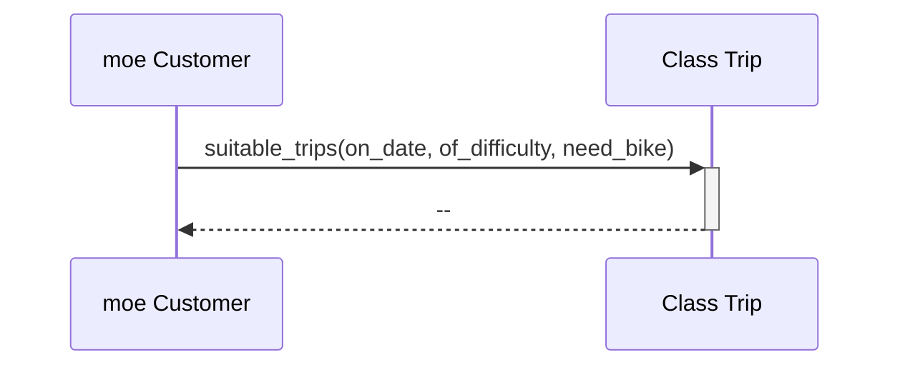
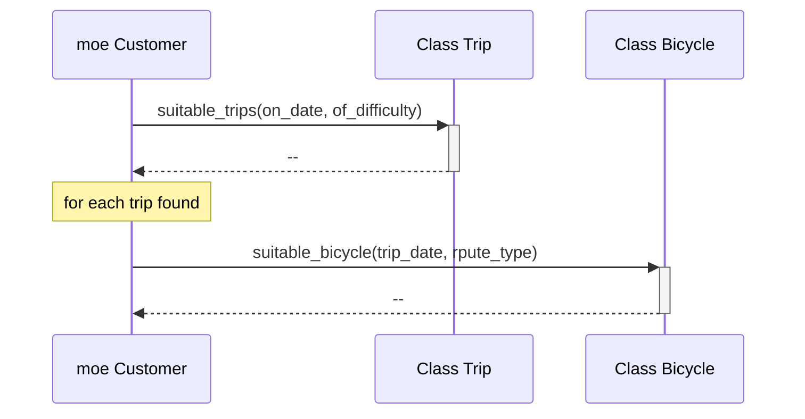
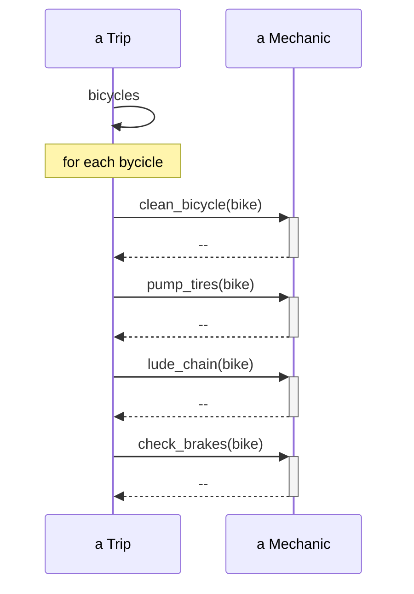
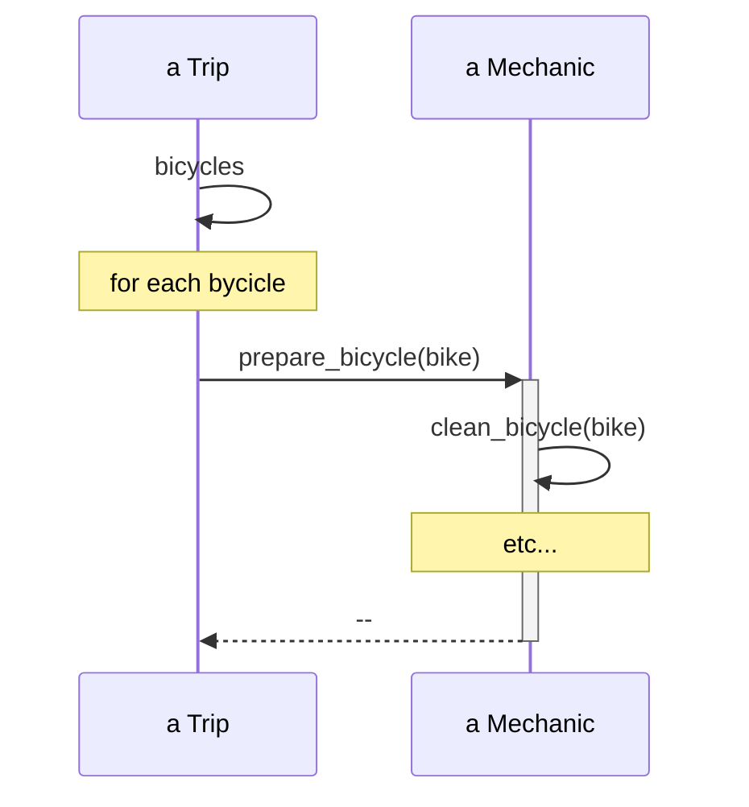
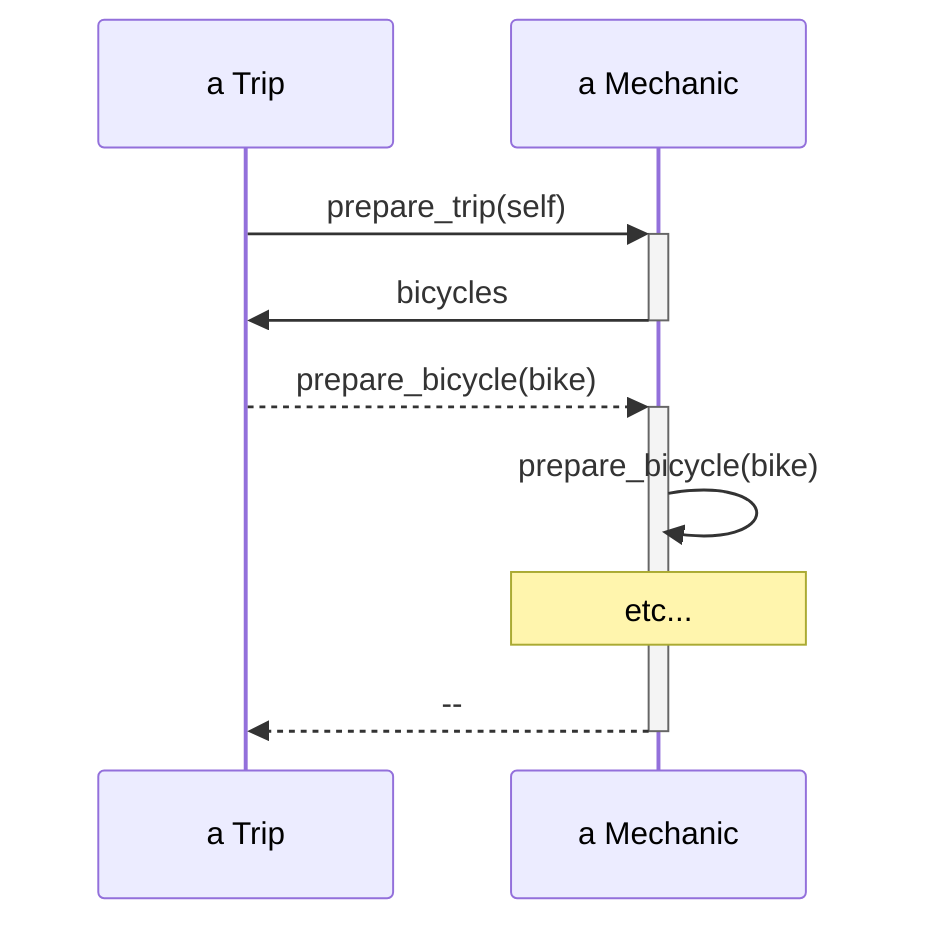
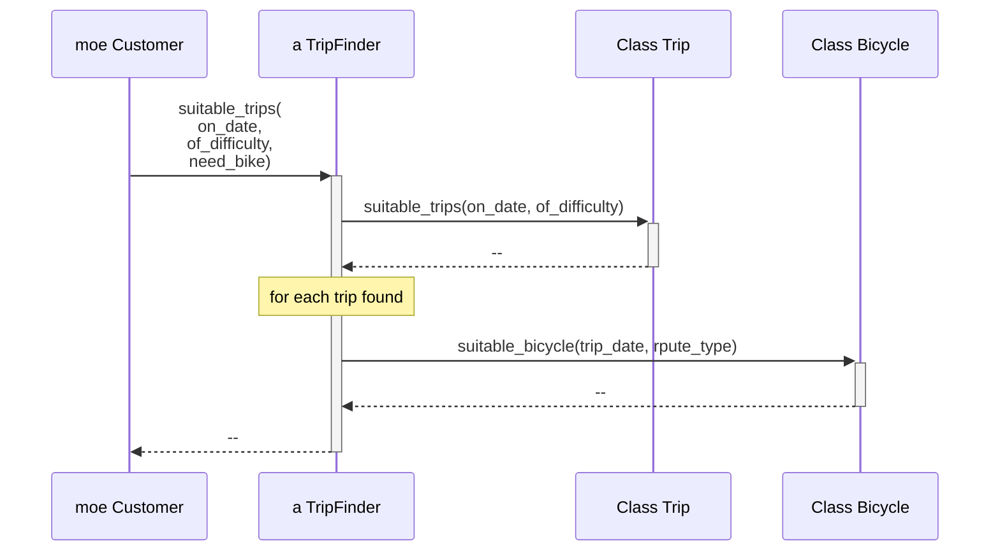

# 柔軟なインターフェースをつくる

オブジェクト指向アプリケーションは「クラスから成り立つ」のですが、メッセージによって定義される。
オブジェクト間の会話はオブジェクトの「インターフェース」を介して行われる。
柔軟なインタフェースの作成を学ぶ。

## インターフェースを理解する（４.１）

絡み合ったオブジェクトの問題の根源は、クラスが何を「明らかにする」かにある。
※クラスが何を「する」かではない

悪い例）
どのオブジェクトのどのメソッドであってもその粒度に関わらず他のオブジェクトから実行できるようになっています。

良い例）
どのメッセージがどのオブジェクトに渡せるのかについて、なんらかの合意と約束があります。それぞれのオブジェクトは、他のオブジェクトが使えるようなメソッドを明確に定義しています。

今回扱うインターフェースは、「クラス内のメソッドと、どのように何を外部に晒すか」であり、それを説明する。（Java にあるようなインターフェースは 6 章）

## インターフェースを定義する(4.2)

パブリックインターフェースとプライベートインターフェースがあり、以下の特性がある

### パブリックインタフェース

- クラスの主要な責任を明らかにする
- 外部から実行されることが想定される
- 気まぐれに変更されない
- 他者がそこに依存していても安全
- テストで完全に文書化されている

### プラベートインターフェース

- 実装の詳細に関わる
- 他のオブジェクトから送られてくることは想定していない
- どんな理由でも変更され得る
- 他者がそこに依存するのは危険
- テストでは、言及さえされないこともある

クラスのうちパブリックな部分は、安定した部分。
対してプライベートな部分は、変化しうる部分。

## パブリックインターフェースを見つける(4.3)

アプリケーションにおいて、データと振る舞いの両方を兼ね備えた「名詞」を「ドメインオブジェクト」と呼ぶことにする。
ドメインオブジェクトが明確なのは、それらが永続するものだからです。
つまり、**ドメインオブジェクトとは大きくて目に見える現実世界のものを表し、かつ最終的にデータベースで表されるもの**だと言える。

**ドメインオブジェクトはアプリケーションを設計する上で中心となるものではありません。ドメインオブジェクトにこだわりすぎると、無理な振る舞いをさせがちです。**

オブジェクトではなく、オブジェクト間で交わされるメッセージに注意を向ける。

### シーケンス図を使う



このシーケンス図では、Moe は Trip クラスが彼に適切な旅行を見つけてくれると期待しています。
一見、日程と難易度によって旅行を見つける責任を Trip が負うのは妥当ですが、Moe は自転車も必要としており、Trip がその準備もしてくれることを明らかに期待しています。

「Trip は、適切な旅行のそれぞれに対し、適切な自転車が利用可能かどうかを調べる責任を負うべきなのだろうか？」

もっと一般的な言い方をすれば、**「この受け手はメッセージに答える責任を負うべきなのだろうか」**

シーケンス図はオブジェクト間で交わされるメッセージを明記します。
そして、オブジェクトはパブリックインターフェースのみを介してのみ互いに交信すべきです。

シーケンス図を用いることで、**設計の重心をクラスから、メッセージへ移すことができる。**

**基本的な設計の質問を、「このクラスが必要なのは知っているけれど、これは何をすべきなのだろう」から、「このメッセージを送る必要があるけれど、誰が応答すべきなんだろう」へ変える**ことがキャリア転向への第一歩です。

ある旅行に対して自転車が利用可能かどうかを Trip クラスが見つけ出すべきでないとすれば、おそらくそれをすべき Bicycle クラスがありそうです。
Trip は suitable_trips に責任をもち、Bicycle が suitable＿bicycle に責任を持つ、とできそうです。

Moe はその両者に話しかけることで、必要な答えを得ることができます。



この設計では、改善している部分もあれば、失敗している部分もある。
Trip から余計な責任を取り除いたものの、残念なことに、単にそれを Customer に移しただけにすぎない。

Moe 自身が「何を」望むかだけでなく、他のオブジェクトが共同作業して「どのように」望むものを準備するかまで知っていることです。
**Customer クラスは、旅行の適切さを評価するためのアプリケーションルールの所有者となっています**。

### 「どのように」を伝えるのではなく「何を」を頼む

送り手の望みを頼むメッセージと、受け手にどのように振る舞うかを伝えるメッセージの違いは些細なものに見えるかもしれません。しかし、その影響は絶大です。

「旅行が開始されるためには、使われる自転車がすべて整備されていることを確実にする必要がある」
Trip は、どのようにすれば自転車を旅行にもっていけるようにできるかを、正確に知る「こともできる」うえ、Mechanic にそれぞれのことをするように頼むこともできます。



- Tirp のパブリックインターフェースは bicycle メソッドを含む
- Mechanic のパブリックインターフェースは clean_bicycle、pump_tires、lube_chain、check_break メソッドを含む。
- Trip は clean_bicycle、pump_tires、lube_chain、check_break に応答できるオブジェクトを持ち続けることを想定する。

この設計では、**Trip は Mechanic が行うことについて、詳細をいくつも知っています。Trip はこの知識を自身で持ち、Mechanic に支持するために使っているので、Mechanic が新たな手順を自転車の準備工程に加えたときは、Trip も変わらなければなりません。**

代案を考える。
ここでは Trip は、Mechanic にそれぞれの Bicycle を準備するように頼み、実装の詳細は Mechanic に任せています。

- Trip のパブリックインターフェースは bicycle メソッドを含む
- Mechanic のパブリックインターフェースは、prepare_bicycle メソッドを含む
- Trip は prepare_bicycle に対応できるオブジェクトを持ち続けることを想定する。



Trip はその責任の大半を Mechanic に渡してしまいました。
Mechanic がタスクを達成してくれると信頼し、「どのように」を知る責任は Mechanic に渡されたので、Trip は将来的に Mechanic にどんな改善があろうとも、この先いつも正しい振る舞いを得ることができます。

Trip と Mechanic の間の会話が「どのように」から「何を」に変わったときの副作用の一つとして、Mechanic のパブリックインターフェースのサイズが一段と小さくなったことが挙げられます。

### コンテキストの独立を模索する

Trip が単一の責任を「持つ」けれど、コンテキストを「求める」と考えましょう。Trip は、prepare_bicycle メッセージに応答できる Mechanic オブジェクトを持ち続けることを想定していました。

Trip を使うときにはいつでもコンテキストが確立されていることが求められます。Trip は常に prepare_bicycle メッセージを自身の Mechanic へ送らなければいけません。prepare_bicycle に応答できる Mechanic のようなオブジェクトを用意しない限り、Trip を再利用するのは不可能です。

考えられる最も良い状況は、オブジェクトがそのコンテキストから完全に独立していることです。相手が誰か、」何をするかも知らずに他のオブジェクトと共同作業できるオブジェクトは、新しく、また予想していなかった方法で再利用することができます。

**依存オブジェクトの注入を使う**
Mechanic が何をするかを知ることなく、Trip が Mechanic の正しい振る舞いを実行することです。Trip はコンテキストの独立を保ちながら、Mechanic と共同作業したいのです。

Trip が Mechanic に、Bicycle を準備するように頼むことは不可避のように見えます。
この問題を解決する方法は、「何を」を「どのように」の違いにあります。

Trip が望んでいることは「準備されること」であり、「何を」にあたる。
旅行が準備されなければならないという知識は Trip の責任。
自転車が必要だという事実は Mechanic の領域に属します。



この例では、Trip は単に Mechanic に対する望み、つまり準備されることを伝えているだけです。そして自信を引数として渡しています。

このシーケンス図では、Trip は Mechanic について何も知りません。
Trip は Mechanic に何を望むかを伝え、self を引数として渡します。
Mechanic は、準備が必要な Bicycle の集まり(は bicycles)を得るため、直ちに Trip をコールバックします

- Trip のパブリックインターフェースは bicycles を含む。
- mechanic のパブリックインターフェースは prepare_trip を含む。ひょっとすると prepare_bicycles を含み得る
- **Trip は prepare_trip に対応できるオブジェクトを持ち続けることを想定する。**
- Mechanic は prepare_trip とともに渡されてきた引数が bicycles に応答することを想定する。

整備士がどのように旅行を準備するかについての知識は、全て Mechanic に隔離されました。
Trip のコンテキストも削減されています。

### 他のオブジェクトを信頼する。

最後の例において、Trip は単に単に prepare_trip を送るためのオブジェクトを保持いているだけです。
このメッセージの受け手を信頼し、適切に振る舞ってくれることを期待しています。
この考えをさらに広げましょう。
Trip はそのようなオブジェクトを配列内にいくつもおいて、それぞれに prepare_trip メッセージを送ることもできそうです。
このとき、Trip は準備してくれるオブジェクトが何をしようとも、そのオブジェクトを信頼しています。準備をするオブジェクトがすることだからです。
(P.104)

```
これは重要っぽい。
この辺は何回も見直そう
```

### オブジェクトを見つけるためにメッセージを使う

最初の例に戻って。。。

Customer が suitable＿trips メッセージを送るのは全く妥当です。
問題は送り手にあるのではありません。受け手にあります。このメソッドを実装する責任のあるオブジェクトをまだ特定できていないのです。

このアプリケーションは、あるオブジェクトを必要としています。Customer、Trip、Bicycle が交差するところにあるルールを具体化するためには、そのオブジェクトがなければいけません。
suitable_trips メソッドはその「オブジェクトの」パブリックインターフェースの一部となるでしょう。

まだ定義されていないオブジェクトがあるという認識を得るための方法は一つだけではありません。多くの方法があります。このシーケンス図によってかけているオブジェクトを発見することの利点は、間違えることのコストがかなり低く、考えを得るためにほとんど躊躇しないことにあります。
おそらくアプリケーションには、TripFinder クラスが含まれるべきでしょう。
次のシーケンス図では、適切な旅行（suitable_trips）見つける責任を TripFinder が負っています。
TripFinder は何がどうなれば適切な旅行になるのかの知識を全て持っています。ルールを知っています。TripFinder の仕事は、このメッセージに応答するために必要なことなら何でも行うことです。

TripFinder は安定してパブリックインターフェースを提供し、また、変化しやすく乱雑な内部実装の詳細は隠しています。



このメソッドを TripFinder に移すことによって、その振る舞いが他のどんなオブジェクトからでも利用できるようになります。未知の未来では、他の旅行会社が、適切な旅行を見つけるために Web サービスを利用して TripFinder を使うこともあるかもしれません。今やこの振る舞いは Customer から抽出されているため、他のどんなオブジェクトからも隔離されたまま、利用できるのです。
