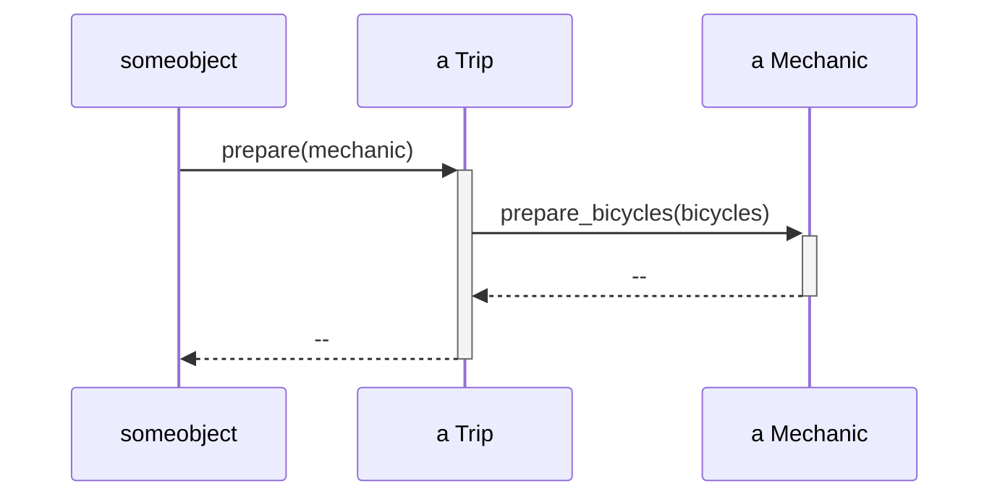
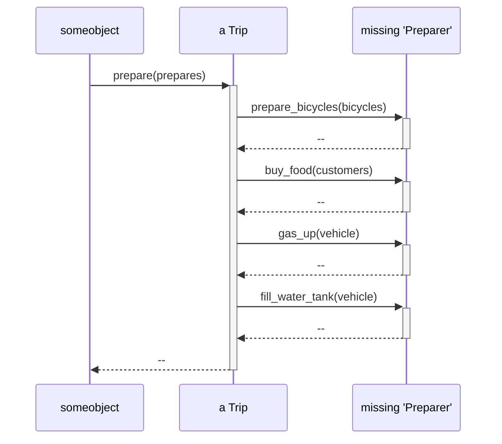
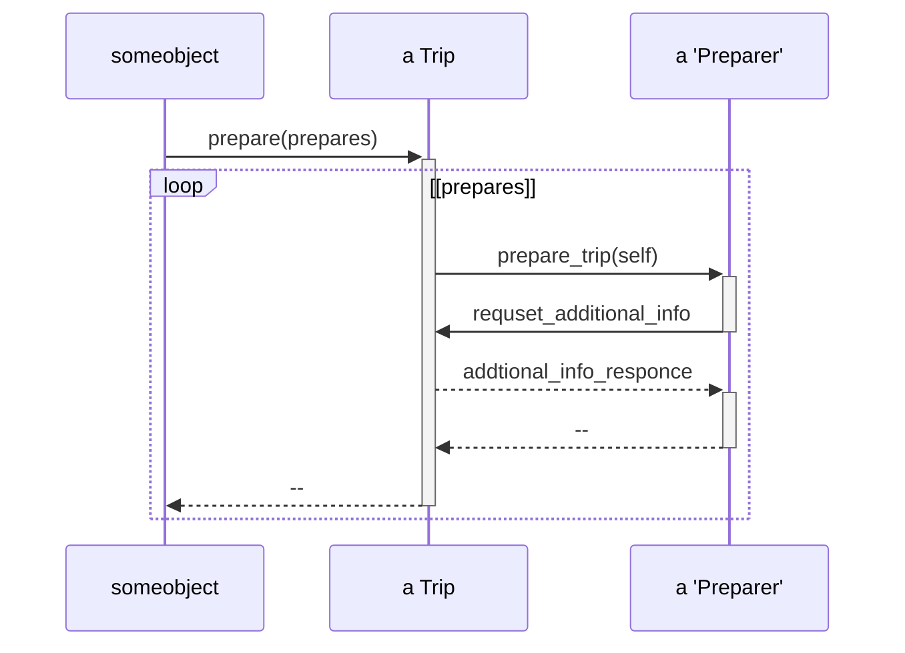

# ダックタイピングでコストを削減する

## ダックタイピングを理解する(5.1)

Ruby における、オブジェクトの振る舞いについての一連の想定は、パブリックインターフェースへの信頼というかたちで行われます。オブジェクトの使い手は、そのクラスに木にする必要はなく、また、気にするべきではありません。クラスはオブジェクトがパブリックインターフェースを獲得するための一つの方法でしかないのです。
クラスという方法で獲得するパブリックインターフェースは、オブジェクトが持ついくつかのパブリックメソッドの一つでしかないこともあります。

重要なのは、オブジェクトが何で「あるか」ではなく、何を「する」かなのです。

ダックタイプを説明する最善の方法は、ダックタイプを使わない場合どうなるかを検討することです。

### ダックを見逃す

Tip の mechanic パラメータに含まれるオブジェクトに prepare_bicycles メソッドを送っています。
Trip が持つクラスはどんなクラスでも良い。

```
class Trip
  attr_reader :bicycles, :customers, :vehicle

  # このmechanic　引数は、どんなクラスのものでも良い
  def prepare(mechanic)
    mechanic.prepare_bicycles(bicycles)
  end

  # ...
end

# このクラスのインスタンスを渡すことになったとしても、動作する。
class Mechanic
  def prepare_bicycles(bicycles)
    bicycles.each { |bicycle| prepare_bicycle(bicycle) }
  end

  def prepare_bicycle(bicycle)
    # ...
  end
end
```

シーケンス



この prepare メソッドは、prepare_bicycles に応答できるオブジェクトを受け取る、ということに依存している。

### 問題を悪化させる

整備士に加え、旅行のコーディネーターと運転手も含まれる。コードパターンに従い、TripCoordeinator と Driver クラスを作るとする。

```

# コーディネーターと運転手を追加
class Trip
  attr_reader :bicycles, :customers, :vehicle

  # prepareでは異なる3つのクラスを名前で参照している上に、
  # それぞれに実装されている具体的なメソッドを知っている。これは危険！
  def prepare(prepares)
    prepares.each do |prepare|
      case preparer
      when Mechanic
        prepare.prepare_bicycles(bicycles)
      when TripCoordinator
        prepare.buy_food(customers)
      when Driver
        prepare.gas_up(vehicle)
        prepare.fill_water_tank(vehicle)
      end
    end
  end
end

class TripCoordinator
  def buy_food(customers)
    # ...
  end
end

class Driver
  def gas_up(vehicle)
    # ...
  end

  def fill_water_tank(vehicle)
    # ...
  end
end
```

設計の創造力がクラスに制限されていると、送っているメッセージを理解し無いオブジェクトに予期せず対応しなければならなくなったとき、それらの新しいオブジェクトが理解「する」メッセージを探しにいくでしょう（→ 上の例だと、buy_food 　とかですね。）

しかし、引数はそれぞれ異なるクラスのものであり、異なるメソッドを実装しています。そのため、case 文での対応でクラスを切り替えることが必要になります。

prepare メソッド内の新たな依存を数えてみましょう。このメソッドは特定のクラスに依存していて、他のクラスは役に立ちません。また、これらのクラスの具体的なメソッド名に依存しています。

### ダックを見つける

依存を取り除く鍵は、「Trip の prepare メソッドは単一の目的を果たすためにあるので、その引数も単一の目的を共に達成するために渡されてくるということを認識すること」です。
どの引数も同じ理由のためにここに存在し、その理由自体は引数の背後にあるクラスとは関係ありません。
**それぞれの引数のクラスの、既存の動作に関する知識に引きずられることは避けねばなりません。その代わりに、prepare が何を必要とするのかについて考えましょう。**

prepare メソッドは、旅行を準備すること（prepare）を望みます。その引数も、旅行の準備に協力しようとやってきます。
prepare が引数のその動作を単に信頼すれば、設計はより簡潔になるでしょう。

prepare において、引数のクラスを想定しなくする。代わりにそれが、「準備するもの（Preparer）」であることが想定されています。



次のステップは、prepare メソッドがそれぞれの Preparer に、どんなメッセージを送れば有益かを問うことでしょう。
この視点で考えれば、prepare_trip です。

Tirp の prepare メソッドは、その引数が prepare_trip に応答できる複数の prepare であることを想定するようになっています。



-> 引数は self なんだという感想。ハッシュで渡した方が安全じゃないかなぁと思ったけど、更新する必要があるなら、self の方がいいか。。。

Preparer とは一体どんな類のものでしょうか。現時点では、具体的な存在は全くありません。Preparer は抽象であり、ある案におけるパブリックインターフェースの取り決めです。設計上の想像でしかありません。
prepare_trip を実装するオブジェクトは、Preparer です。逆に言えば、Preparer と相互作用するオブジェクトに必要なのは、それが Preparer のインターフェースを実装していると信頼することだけです。この根底にある抽象に一度気づけば、コードを修正するのは簡単でしょう。Mechainc と TripCoordinator、そして Driver は、Preparer のように振る舞うべきです。つまり、prepare_trip を実装するべきなのです。

```
# 新しい設計。preparaメソッドは引数が複数のPreparerであることを想定しています。
class Trip
  attr_reader :bicycle, :customer, :vehicle

  def prepare(prepares)
    prepares.each do |prepare|
      prepare.prepare_trip(self)
    end
  end
end

# 全ての準備者(Preparer)は、
# prepare_tripに応答するダック
class Mechanic
  def prepare_trip(trip)
    trip.bicycle.each do |bicycle|
      prepare_bicycle(bicycle)
    end
  end

  # ...
end

class TripCoordinator
  def prepare_trip(trip)
    buy_food(trip.customers)
  end
end

class Driver
  def prepare_trip(trip)
    vehicle = trip.vehicle
    gas_up
    fill_water_tank(vehicle)
  end
end
# このprepareメソッドは、新しいPreparerを受け入れる際に、変更が強制されることはありません。
# また、必要に応じて追加のPreparerを作るのも簡単です。
```

### ダックタイピングの影響

最初の例では、prepare は具象クラスに依存していました。直近で見た例では、prepare はダックタイプに依存しています。この二つの例の間にある道筋は、依存が満載で複雑なコードの茂みを通り抜けています。
