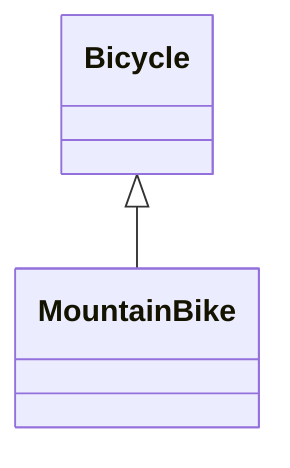
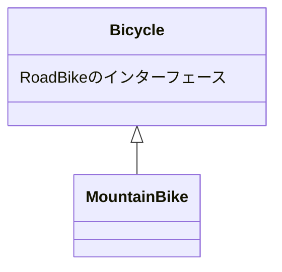
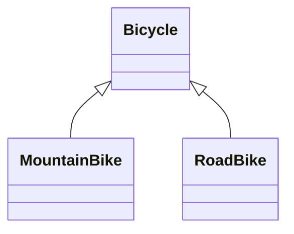
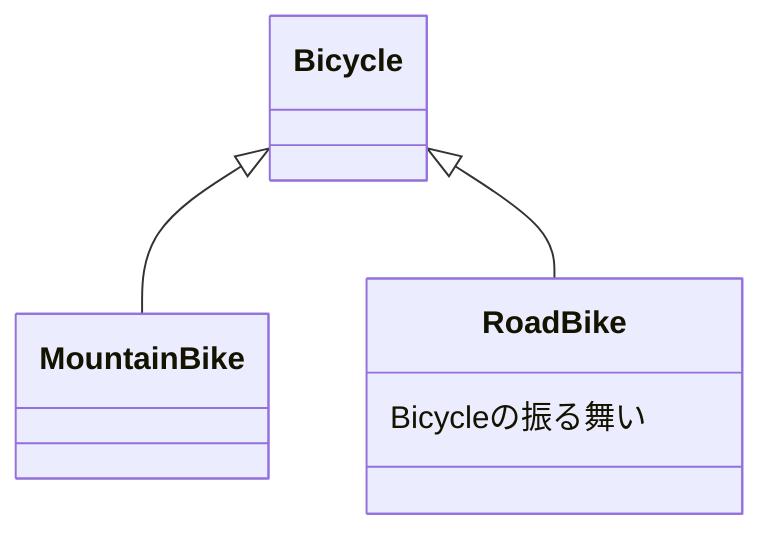

# 継承によって振る舞いを獲得する

継承を適切に使ったコードをどのように書くか
確かな専門的根拠に基づいた継承階層の作り方を説明する。

## クラスによる継承を理解する(6.1)

継承とは、根本的に「メッセージの自動委譲」の仕組み。
あるオブジェクトが受け取ったメッセージに応答できなければ、他のオブジェクトにそのメッセージを委譲するというような関係です。

クラスによる継承はクラシカル・インヘリタンス（classical inheritance）と表記されますが、これは単に「クラス」という言葉にかけた表記であり、古典的なテクニックではありません。この言葉は、スーパークラス/サブクラスの機構を他の継承テクニックから区別するために役立ちます。

## 継承を使うべき箇所を識別する（6.2）

最初の課題は、継承を使うと有益な箇所を識別することです。
ロードバイクは軽くてハンドルの曲がった（ドロップバー）、細いタイヤの自転車であり、舗装された道路用です。

### 具象クラスから始める

すでに Bicycle クラスがある。
旅行に持って行くロードバイクは、すべてこのクラスのインスタンスで表現されます。
自転車には、全体のサイズ、ハンドルバーのテープカラー、タイヤのサイズ、チェーンタイプがあります。

```
class Bicycle
  attr_readeer :size, :tire_color

  def initialize(args)
    @size = args[:size]
    @tape_color = args[:tape_color]
  end

  # すべての自転車は、デフォルト値として
  # 同じタイヤサイズとチェーンサイズを持つ

  def spares
    {
      chain: '10-speed',
      tire_size: '23',
      tape_color: tape_color
    }
  end

  # 他にもメソッドが沢山
end
```

Bicycle インスタンスは、spares、size、tape_color メッセージに対応できる。
Mechanic は、各 Bicycle に spares を聴くことで、どのスペアパーツが必要なのかを知ることができます。

マウンテンバイクでの旅行も初める場合を考える。
マウンテンバイクは、舗装されていない荒れた道を走るように作られており、舗装された道向けではありません。
頑丈なフレームに、太いタイヤ、真っ直ぐなハンドル（テープではなくラバー製のグリップ）、サスペンションを備えています。

**ここでの設計課題は、アプリケーションをマウンテンバイクに対応させることです。
ロードバイクとの違いは、ロードバイクはハンドルバーのテープを必要とし、マウンテンバイクはサスペンションを備えるということです。**

### 複数の型を埋め込む

以前から存在する具象クラスが必要な振る舞いのほとんどをすでに備えているのであるれば、そのクラスにコードを追加することでこの問題を解いてみたくなるでしょう。
次の例では、まさに、既存の Bicycle クラスをへ変更し、ロードバイク、マウンテンバイクの両方で spares が動作するということをしています。

対応するアクセサと共に変数が新しく 3 つ追加されています。
新たに追加された front_shock と rear_shock 変数は、マウンテンバイク固有の部品を持ちます。
style 変数は、Bicycle のインスタンスを二つに分類する役割を果たします。style が road とそれ以外のものに分けるのです。

```

class Bicycle
  attr_reader :style, :size, :tape_color, :front_shock, :rear_shock

  def initialize(args)
    @style = args[:style]
    @size = args[:size]
    @tape_color = args[:tape_color]
    @front_shock = args[:front_shock]
    @rear_shock = args[:rear_shock]
  end

  # styleの確認は危険な道へ進む一歩
  def spares
    if style == :road
      {
        chain: '10-speed',
        tire_size: '23', # milimeter
        tape_color: tape_color
      }
    else
      {
        chain: '10-speed',
        tire_size: '2.1', # inches
        rear_shock: rear_shock
      }
    end
  end
end
```

style に基づきスペアパーツを決定している。この場合、新たな style を追加するときは、if 文を変更しなければならない。
spares メソッドはデフォルトの文字列を持つ埋め込む形で作られましたが、中にはもう if 文の両方の節で重複して使われる文字列もあります。

Bicycle は個々の部品全てを含暗黙的なパブリックインターフェースを持つ。しかし、特定の部品について、初期化されている保証はない。（ロードバイクだと、マウンテンバイクの部品のインターフェースはあるが、初期化はされていない）

このコードは if 文を含みます。この if 文は「自身の分類を保持する属性」を確認し、それに基づき「自身」に送るメッセージを決定するものです。

### 埋め込まれた型を見つける

spares メソッド内にある if は style という名前の変数によって分岐します。
しかし、この変数は type や category というような名前でもおかしくなく、それらはクラスを説明するときの言葉と危険なほど似通っている。

style 変数は Bicycle のインスタンスを実質的に二つに分ける。これらの 2 つのものは振る舞いの大部分を共有しますが、style の面では異なります。
Bicycle の振る舞いには、すべての自転車に当てはまるものもあれば、ロードバイクのみ、マウンテンバイクのみに当てはまるものもあります。

継承は共通の振る舞いを持つものの。いくつかの面において異なるという、強く関連した型の問題を解決します。

### 継承を選択する

オブジェクトのメッセージの処理の方法は、最終的には以下の 2 つのどちらか。

「直接応答するか、応答してもらうべく他のオブジェクトにメッセージを渡すか。」

継承によって 2 つのオブジェクトが家計を持つように定義できます。その関係によって、**1 つ目のオブジェクトが応答できないものであった場合、自動的に転送（委譲）を行い、そのメッセージを 2 つ目のオブジェクトに渡せる**ようになります。

クラスによる継承を利用したメッセージの転送は、「クラス」間で行われます。ダックタイプはクラスを横断するものですから、クラスによる継承を使って振る舞いを共有することはありません。ダックタイプがコード共有のために使うのは、Ruby のモジュールです。
→ 継承とダックタイプは違うものだよ　ということが言いたいんだと思う。

サブクラスが、スーパークラスの全てであり、かつスーパークラスを「上回る」ものであるということです。
例えば、すべての String は Object のパブリックインターフェースをすべて持っていると想定されるだけでなく、そのインターフェースに定義されるどのメッセージにも、適切にレスポンスを返すことが求められます。それゆえ**サブクラスはそのスーパークラスを特化したものと言えるでしょう。**

マウンテンバイクは自転車を特化したものと捉えられるので、Bicycle を MountainBike のスーパークラスにできそう。



## 継承を不適切に適用する(6.3)

MountainBike クラスを実装していく。

最初の試みは、元の Bicycle クラスから直接派生した新しいサブクラス。
initialize と　 spares というメソッドを実装（いわゆるオーバーライド）する。

```
class MountainBike < Bicycle
  attr_reader :front_shock, :rear_shock

  def initialize(args)
    @front_shock = args[:front_shock]
    @rear_shock = args[:rear_shock]
    super(args)
  end

  def spares
    super.merge(rear_shock: reat_shock)
  end
end
```

この MountainBike クラスを既存の Bicycle クラスの直下に押し込めるのはあまりにも楽観的で欠陥がある。
MountainBike のインスタンスの中には全く役に立たないメソッドがある。
次の例では、MountainBike に size と spares を聞いた場合に何が起こるかを示しています。

```
class MountainBike < Bicycle
  attr_reader :front_shock, :rear_shock

  def initialize(args)
    @front_shock = args[:front_shock]
    @rear_shock = args[:rear_shock]
    super(args)
  end

  def spares
    super.merge(rear_shock: rear_shock)
  end
end

mountain_bike = MountainBike.new(
  size: 'S',
  front_shock: 'Manitou',
  rear_shock: 'Fox'
)

mountain_bike.size
# -> 'S'

mountain_bike.spares
# -> {:chain=>"10-speed",
      :tire_size=>"23",  <-間違い
      :tape_color=>nil,  <-不適切
      :rear_shock=>"Fox"}
```

MountainBikeo のインスタンスがロードバイクとマウンテンバイクの振る舞いをごちゃ混ぜに含んでいることに、驚きはありません。
**いまの Bicycle は具象クラスであり、サブクラスが作られるようには作られていない**からです。

このインスタンスは、一般的な自転車の振る舞いと、ロードバイク固有の振る舞いをすべて継承することになります。一般的な振る舞いも固有の振る舞いも、当てはまるかどうかに関わらず MountainBike は継承しています。



MountainBike は望みもしなければ必要でもない振る舞いを継承することになる。
この Bicycle は、MountainBike の親と MountainBike と同階層のものの両方に適する振る舞いを持っています。
したがって Bicycle は MountainBike のスーパークラスを務めるべきではありません。

## 継承を見つける(6.4)

最初は自転車という概念が一つでした。それが、単一のクラスである Bicycle としてモデル化されました。現存する Bicycle クラスは特定の種類の自転車であるロードバイクを表しています。
すべての Bicycle がロードバイクであるアプリケーションにおいては、この名付けは申し分なく適切であり、最初のクラス名としては申し分ない。

しかし、今は MountainBike が存在するので、Bicycle という名前は誤解を招く。これらの 2 つのクラス名は、継承であることを「暗に示して」います。

サブクラスはスーパークラスを「特化したもの」です。MountainBike は Bicycle を上回るものであるべきでしょう。Bicycle を待ち受けるオブジェクトは。実際んクラスが何であるかなど知らずとも、MountainBike とやりとりできるべき。

継承が効果を発揮するためには、次の 2 つのことが常に成立している必要があります。

- モデル化しているオブジェクトが一般 - 特殊の関係を持っていること。（汎化 - 特化　ともいうらしい）
- 正しいコーディングテクニックを使っていること。

ロードバイクのコードを Bicycle の外に出して、分離した RoadBike クラスサブクラスに入れます。

###　抽象的なスーパークラスをつくる
新たなクラス図を示す。
Bicycle が MountainBike と RoadBikeno 両方のスーパークラスとなっている。これが最終的な目標です。



現在、Bicycle は「抽象」クラスを表しています。抽象は「いかなる特定のインスタンスからも離れている」。
この新しいバージョンの**Bicycle が、完全な自転車を定義することはありません。定義するのは、すべての自転車が共有するもの**のみです。
Ruby には Java の abstract キーワードのようなものはなく、抽象クラスのインスタンス化について制約を追加できない。

抽象クラスはサブクラスが作られるために存在します。抽象クラスは、サブクラス間で共有される振る舞いの共通の格納場所を提供します。そしてサブクラスが、それぞれに特化したものを用意するのです。

```
# Bicycleを抽象クラス化
class Bicycle
  # このクラスはもはや空となった
  # コードはすべてRoadBikeに移された
end

class RoadBike < Bicycle
  # いまはBicycleのサブクラス
  # かつてのBicycleクラスからのコードをすべて含む
end

class MountainBike < Bicycle
  # Bicycle のサブクラスのまま（Bicycleは現在空になっている）
  # コードは何も変更されていない
end
```

この新しい RoadBike 句タスは、Bicycle のサブクラスとして定義されています。MountainBike が依存するコードは親ではなく同階層の仲間のところに置かれるようになりました。

このコードの再構成で、すべての自転車に必要とされる共通の振る舞いは RoadBike の内部の元に置かれているため、MountainBike からはアクセスできなくなっています。
今は RoadBike がすべての共通の振る舞いを含んでいる。



共通の振る舞いを Bicycle 内に移動し、その振る舞いを効果的にサブクラス内で使うことで、この新しいクラス構造を完成させます。

###　抽象的な振る舞いを昇格する
size と spares メソッドはすべての自転車に共通します。この振る舞いは Bicycle のパブリックインターフェースに属します。
どちらのメソッドも現在は RoadBike の下に置かれています。

size の振る舞いをスーパークラス内に昇格するためには、次の例に示されるように、変更が 2 つ必要です。

- 属性の読み取りメソッドと初期化のコードは RoadBike から Bicycle に移動
- RoadBike の initialize メソッドは super への返信を追加

```

# 共通部分をRoadBikeからBicycleに移動
class Bicycle
  attr_reader :size # <- RoadBikeから昇格

  def initialize(args={})
    @size = args[:size] # <- RoadBikeから昇格
  end
end

class RoadBike < Bicycle
  attr_reader :tape_color

  def initialize(args)
    @tape_color = args[:tape_color]
    super(args) # <- RoadBikeはsuperを必ず呼ばなければならなくなった
  end

  # ...
end
```

一連のリファクタリングで、自転車の size を処理するコードがこれまで 2 回移動したことに気づくでしょう。
最初は Bicycle にあり、次に RoadBike に「おろされ」、現在は再度 Bicycle に昇格し、「上」に戻されました。

この中間の手順を飛ばし、単純にこのコード片を Bicycle の最初のコードにしてしまいたくなるかもしれません。
しかし、この **「全てを下げてその中のいくつかを引き上げる」戦略は、このリファクタリングの重要な部分** です。
**継承の難しさの多くは、抽象と具体を厳密に分けることに失敗することによって生じます。**

Bicycle からリファクタリングを始め、その具象的なコードを分離して RoadBike に押し下ようとしたとしましょう。
その場合、どんな失敗であれ、具象的な危険物をスーパークラスに残すことになります。
Bicycle のコードを全て移してから始めれば、**具象的な人工物を残してしまう恐れもなく、抽象的な部分を注意深く特定し、昇格させる**ことができます。

**リファクリングの戦略を決める時のみならず、設計の戦略を決める際、有用であるのは、「もし間違っているとすれば、何がおこるだろう」と
質問することです。**

### 具象から抽象に分ける

RoadBike と MountainBike は両方とも独自化した spares を実装しています。RoadBike の定義は元のものと同じであり具象クラスだった Bicycle からコピーしてきたものなので今のままでも動く。

```
class RoadBike < Bicycle
  # ...
  def spares
    {
      chain: '10-speed',
      tire_size: '23',
      tape_color: tape_color
    }
  end
end
```

MountainBike 内の spares の定義は最初にサブクラスをサブクラスを作ろうとしたときのままです。このメソッドは super を送信しており、スーパークラスも spares を実装していることを想定しています。

```
class MountainBike < Bicycle
  # ...
  def spares
    super.merge(rear_shock: rear_shock)
  end
end
```

しかし Bicycle は、まだ spares メソッドを実装していません。したがって、spares を MountainBike に送ると NoMethodError 例外が発生します。

この問題を修正するためには、Bicycle に spares メソッドを追加する必要があるが、既存のコードを RoadBike から昇格するほど単純なことではない。

RoadBike の spares の実装は、かなり知識を持ちすぎている。chain と tire_size 属性はすべての自転車に共通しますが、tape_color はロードバイクだけが知るべきでしょう。
抽象は Bicycle に昇格させ、具体的な部分は RoadBike に残るようにしましょう。

すべての自転車に共通する部分、つまり、chain と tire_size だけを昇格することに注力します。
要件は次の通り。

- 自転車はチェーン（chain）とタイヤサイズ（tire_size）を持つ
- すべての自転車はチェーンについて同じ祖基地を共有する。
- サブクラスは、タイヤサイズについて独自の初期値を持つ。
- サブクラスのここのインスタンスは初期値を無視し、インスタンス固有の値を保つことが許される。

size、chain、tire_size を同じような方法で処理する新しいコード。

```
class Bicycle
  attr_reader :size, :chain, :tire_size

  def initialize(args)
    @size = args[:size]
    @chain = args[:chain]
    @tire_size = args[:tire_size]
  end

  # ...
end
```

RoadBike と MountainBike は attr_reader の定義を Bicycle から継承するうえ、どちらも initialize メソッド内で super を送ります。
これで、全てにの自転車が size、chain、tire_size を理解するようになりました。これらの属性に対してそれぞれの自転車がサブクラス固有の値を用意することもできるでしょう。

このコードでは、継承されることを「想定した」ものには感じられないが初期値について、2 つの要求を満たすことで、興味深いことが起こる。

### テンプレートメソッドパターンを使う

Bicycle の initialize メソッドをかえ、初期値を得るためにメッセージを送るようにします。具体的には、default_chain と default_tire_size というメッセージを追加します。

初期値をメソッドで包み隠すのは良い習慣ですが、新しいメッセージを送る音には 2 つの目的があります。Bicycle において、これらのメッセージを送る 1 番の目的は**それらをオーバーライドすることによって、何かに特化できる機会をサブクラスに与える**ことです。
スーパークラス内で基本の構造を定義し、サブクラス固有の貢献をるためにメッセージを送るというテクニックは、「テンプレートメソッド」パターンとして知られています。
次のコードにおいて MountainBike と RoadBike は、この機会のうち、1 回だけ活用しています。両方ともで default_tire_size メソッドを実装していますが、どちらも default_chain メソッドは実装していません。それゆえ、**それぞれのサブクラスは、タイヤサイズには独自の初期値を用意するものの、チェーンには共通の初期値を継承します**。

```

class Bicycle
  attr_reader :size, :chain, :tire_size

  def initialize(args)
    @size = args[:size]
    @chain = args[:chain] || default_chain
    @tire_size = args[:tire_size] || default_tire_size
  end

  def default_chain # <-共通の初期値
    '100-speed'
  end
end

class RoadBike < Bicycle
  # ...

  def default_tire_size
    '23'
  end
end

class MountainBike < Bicycle
  # ...

  def default_tire_size
    '2.1'
  end
end
```

現在のコードでは、Bicycle はサブクラスの構造を提供するようになった。
サブクラスがアルゴリズムに影響を与えることを許可する場所に関しては、Bicycle はメッセージを送るようにしています。（サブクラスでそれをオーバーロードします。）

### すべてのテンプレートメソッドを実装する

Bicycle の iniitalize メソッドは default_tire_size を送りますが、bicycle 自体はそれを実装していません。これが問題になる。

新しくリカベントを追加する。
以下のように default_tire_size の実装に注意を払わなかった場合、エラーになる。

```
class RecumbentBike < Bicycle
  def default_chain
    '9-speed'
  end
end
```

この問題の根源にあるのは、コードを一見するだけでは明確に把握できない要件を、Bicycle がサブクラスに課していることです。
（Bicycle のサブクラスは、default_tire_size を「必ず」実装している必要がある。）
対策は、テンプレートメソッドパターンを使うどのクラスも、その送信するメッセージの全てに、必ず実装を用意するようにすることです。

```
class Bicycle
  # ...

  def default_tire_size
    raise NotImplementedError
  end
end

# 追加の情報を明示的に与える

class Bicycle
  # ...

  def default_tire_size
    raise NotImplemetError,
          "This #{self.class} cannot respond to:"
  end
end
```

## スーパークラスとサブクラス間の結合度を管理する（６.５）

spares のスーパークラスでの実装は、さまざまな方法でかけます。
これらの違いはどれほど強固にサブクラスとスーパークラスを結合するかにあります。

### 結合度を理解する

この最初の spares の実装は書くのは簡単ですが、最も強固に結合されたクラスを生み出します。

```
class Bicycle
  attr_reader :size, :chain, :tire_size

  def initialize(args = {})
    @size = args[:size]
    @chain = args[:chain]
    @tire_size = args[:tire_size]
  end

  def spares
    {
      tire_size: tire_size,
      chain: chain
    }
  end

  def default_chain
    '10-speed'
  end

  def default_tire_size
    raise NotImplementedError
  end
end

class RoadBike < Bicycle
  attr_reader :tape_color

  def initialize(args)
    @tape_color = args[:tape_color]
    super(args)
  end

  def spares
    super.merge({ tape_color: tape_color })
  end

  def default_tire_size
    '23'
  end
end

class MountainBike < Bicycle
  attr_reader :front_shock, :rear_shock

  def initialize(args)
    @front_shock = args[:front_shock]
    @rear_shock = args[:rear_shock]
    super(args)
  end

  def spares
    super.merge({ rear_shock: rear_shock })
  end

  def default_tire_size
    '2.1'
  end
end
```

MountainBike と RoadBike サブクラスが同じようなパターンに従っていることに気づいてください。これらはそれぞれ自分自身（特化したスペアパーツ）についても、それぞれのスーパークラス（ハッシュを返す spares を実装してるということ、initialize に応答するということ）についても知っています。

他のクラスについての知識を持つということは、依存を作り依存はオブジェクトを互いに結合します。

次のコードはそのトラップを説明したものです。

```

class RecumbentBike < Bicycle
  attr_reader :flag

  def initialize(args)
    @flag = args[:flag] # superを送信するのを忘れた
  end

  def spares
    super.merge({ flag: flag })
  end

  def default_chain
    '9-speed'
  end

  def default_tire_size
    '28'
  end
end

bent = RecumbentBike.new(flag: 'tall and orange')
bent.spares
# ->{
#     tire_size: nil,  <- 初期化されてない
#     chain: nil,
#     flag: 'tall and orange'
#   }
```

RecumbentBike が initialize の中で super を送るのに失敗すると、RecumbentBike は Bicycle によって提供される共通の初期あが行われないことになります。

お d んなプログラマーでも super を送り忘れることはあるため、これらのエラーの原因絵を作りえるでしょう。

この階層構造でのコードのパターンでは、**サブクラスは自身が行うことだけでなく、スーパークラスとどのように関わるかまで知っておくことが要求されます**。

すべてのサブクラスが正確に同じ箇所で super を送ることが求められます。
その点で、サブクラスは依存していると言える。

### フックメソッドを使ってサブクラスを疎結合にする

これらの問題はすべて、最後のリファクタリングを 1 つ加えれば回避できます。サブクラスにアルゴリズムを知ることを許し、super を送るよう求めるのではなく、スーパークラスが代わりに「フック」メッセージを送るようにすることができます。。
フックメッセージはサブクラスがそれに合致するメソッドを実装することによって情報を提供できるようにするための専門のメソッドです。

```

class Bicycle
  def initialize(args = {})
    @size = args[:size]
    @chain = args[:chain] || default_chain
    @tire_size = args[:tire_size] || default_tire_size

    post_initialize(args) # Bicycleでは送信と
  end

  def post_initialize(_args) # 実装の両方を行う
    nil
  end

  # ...
end

class RoadBike < Bicycle
  def post_initialize(args) # RoadBikeは任意でオーバーライドできる
    @tape_color = args[:tape_color]
  end
  # ...
end
```

→ 依存性の逆転っぽいことをしてる！！

BF: サブクラスは、スーパークラスのメソッドのいくつかが、super に反応することを知っている
AF: スーパークラスは、サブクラスがフックメソッドに反応することを知っている。（厳密にはスーパークラス何のメソッドをオーバーライドするので、違うけど。。。）

この変更では、super の送信を RoadBike の initialize メソッドから取り除いたのではなく、initialize メソッドそのものをすっかり取り除いてしまいました。
RoadBike はもはや初期化を制御することはありません。

RoadBike は自身が「何を」初期化する必要があるかについての責任をまだ負っています。しかし、「いつ」初期化が行われるかには責任がありません。
この変更によって、**RoadBike の bicycle についての知識はより少なくできます**。

タイミングの制御をスーパークラスに任せると、サブクラスに変更を矯正せずともアルゴリズムを変更できるようになります。
Bicycle が spares を実装していて、その実装がハッシュを返すという知識を RoadBike 矯正せずとも、Bicycle に制御を戻すフックメソッドを実装することで結合を緩めることができるのです。

spares メソッドについても変更を加える。

```

class Bicycle
  # ...

  def spares
    {
      tire_size: tire_size,
      chain: chain
    }.merge(local_spares)
  end

  # サブクラスがオーバーライドするためのフック
  def local_spares
    {}
  end
end

class RoadBike < Bicycle
  # ...
  def local_spares
    {
      tape_color: tape_color
    }
  end
end
```
