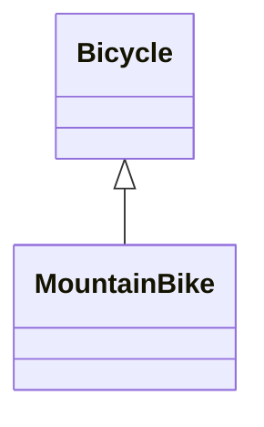
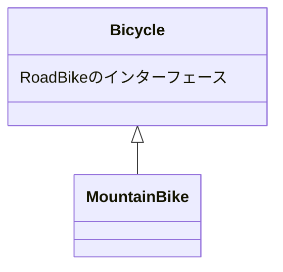

# 継承によって振る舞いを獲得する

継承を適切に使ったコードをどのように書くか
確かな専門的根拠に基づいた継承階層の作り方を説明する。

## クラスによる継承を理解する(6.1)

継承とは、根本的に「メッセージの自動委譲」の仕組み。
あるオブジェクトが受け取ったメッセージに応答できなければ、他のオブジェクトにそのメッセージを委譲するというような関係です。

クラスによる継承はクラシカル・インヘリタンス（classical inheritance）と表記されますが、これは単に「クラス」という言葉にかけた表記であり、古典的なテクニックではありません。この言葉は、スーパークラス/サブクラスの機構を他の継承テクニックから区別するために役立ちます。

## 継承を使うべき箇所を識別する（6.2）

最初の課題は、継承を使うと有益な箇所を識別することです。
ロードバイクは軽くてハンドルの曲がった（ドロップバー）、細いタイヤの自転車であり、舗装された道路用です。

### 具象クラスから始める

すでに Bicycle クラスがある。
旅行に持って行くロードバイクは、すべてこのクラスのインスタンスで表現されます。
自転車には、全体のサイズ、ハンドルバーのテープカラー、タイヤのサイズ、チェーンタイプがあります。

```
class Bicycle
  attr_readeer :size, :tire_color

  def initialize(args)
    @size = args[:size]
    @tape_color = args[:tape_color]
  end

  # すべての自転車は、デフォルト値として
  # 同じタイヤサイズとチェーンサイズを持つ

  def spares
    {
      chain: '10-speed',
      tire_size: '23',
      tape_color: tape_color
    }
  end

  # 他にもメソッドが沢山
end
```

Bicycle インスタンスは、spares、size、tape_color メッセージに対応できる。
Mechanic は、各 Bicycle に spares を聴くことで、どのスペアパーツが必要なのかを知ることができます。

マウンテンバイクでの旅行も初める場合を考える。
マウンテンバイクは、舗装されていない荒れた道を走るように作られており、舗装された道向けではありません。
頑丈なフレームに、太いタイヤ、真っ直ぐなハンドル（テープではなくラバー製のグリップ）、サスペンションを備えています。

**ここでの設計課題は、アプリケーションをマウンテンバイクに対応させることです。
ロードバイクとの違いは、ロードバイクはハンドルバーのテープを必要とし、マウンテンバイクはサスペンションを備えるということです。**

### 複数の型を埋め込む

以前から存在する具象クラスが必要な振る舞いのほとんどをすでに備えているのであるれば、そのクラスにコードを追加することでこの問題を解いてみたくなるでしょう。
次の例では、まさに、既存の Bicycle クラスをへ変更し、ロードバイク、マウンテンバイクの両方で spares が動作するということをしています。

対応するアクセサと共に変数が新しく 3 つ追加されています。
新たに追加された front_shock と rear_shock 変数は、マウンテンバイク固有の部品を持ちます。
style 変数は、Bicycle のインスタンスを二つに分類する役割を果たします。style が road とそれ以外のものに分けるのです。

```

class Bicycle
  attr_reader :style, :size, :tape_color, :front_shock, :rear_shock

  def initialize(args)
    @style = args[:style]
    @size = args[:size]
    @tape_color = args[:tape_color]
    @front_shock = args[:front_shock]
    @rear_shock = args[:rear_shock]
  end

  # styleの確認は危険な道へ進む一歩
  def spares
    if style == :road
      {
        chain: '10-speed',
        tire_size: '23', # milimeter
        tape_color: tape_color
      }
    else
      {
        chain: '10-speed',
        tire_size: '2.1', # inches
        rear_shock: rear_shock
      }
    end
  end
end
```

style に基づきスペアパーツを決定している。この場合、新たな style を追加するときは、if 文を変更しなければならない。
spares メソッドはデフォルトの文字列を持つ埋め込む形で作られましたが、中にはもう if 文の両方の節で重複して使われる文字列もあります。

Bicycle は個々の部品全てを含暗黙的なパブリックインターフェースを持つ。しかし、特定の部品について、初期化されている保証はない。（ロードバイクだと、マウンテンバイクの部品のインターフェースはあるが、初期化はされていない）

このコードは if 文を含みます。この if 文は「自身の分類を保持する属性」を確認し、それに基づき「自身」に送るメッセージを決定するものです。

### 埋め込まれた型を見つける

spares メソッド内にある if は style という名前の変数によって分岐します。
しかし、この変数は type や category というような名前でもおかしくなく、それらはクラスを説明するときの言葉と危険なほど似通っている。

style 変数は Bicycle のインスタンスを実質的に二つに分ける。これらの 2 つのものは振る舞いの大部分を共有しますが、style の面では異なります。
Bicycle の振る舞いには、すべての自転車に当てはまるものもあれば、ロードバイクのみ、マウンテンバイクのみに当てはまるものもあります。

継承は共通の振る舞いを持つものの。いくつかの面において異なるという、強く関連した型の問題を解決します。

### 継承を選択する

オブジェクトのメッセージの処理の方法は、最終的には以下の 2 つのどちらか。

「直接応答するか、応答してもらうべく他のオブジェクトにメッセージを渡すか。」

継承によって 2 つのオブジェクトが家計を持つように定義できます。その関係によって、**1 つ目のオブジェクトが応答できないものであった場合、自動的に転送（委譲）を行い、そのメッセージを 2 つ目のオブジェクトに渡せる**ようになります。

クラスによる継承を利用したメッセージの転送は、「クラス」間で行われます。ダックタイプはクラスを横断するものですから、クラスによる継承を使って振る舞いを共有することはありません。ダックタイプがコード共有のために使うのは、Ruby のモジュールです。
→ 継承とダックタイプは違うものだよ　ということが言いたいんだと思う。

サブクラスが、スーパークラスの全てであり、かつスーパークラスを「上回る」ものであるということです。
例えば、すべての String は Object のパブリックインターフェースをすべて持っていると想定されるだけでなく、そのインターフェースに定義されるどのメッセージにも、適切にレスポンスを返すことが求められます。それゆえ**サブクラスはそのスーパークラスを特化したものと言えるでしょう。**

マウンテンバイクは自転車を特化したものと捉えられるので、Bicycle を MountainBike のスーパークラスにできそう。



## 継承を不適切に適用する(6.3)

MountainBike クラスを実装していく。

最初の試みは、元の Bicycle クラスから直接派生した新しいサブクラス。
initialize と　 spares というメソッドを実装（いわゆるオーバーライド）する。

```
class MountainBike < Bicycle
  attr_reader :front_shock, :rear_shock

  def initialize(args)
    @front_shock = args[:front_shock]
    @rear_shock = args[:rear_shock]
    super(args)
  end

  def spares
    super.merge(rear_shock: reat_shock)
  end
end
```

この MountainBike クラスを既存の Bicycle クラスの直下に押し込めるのはあまりにも楽観的で欠陥がある。
MountainBike のインスタンスの中には全く役に立たないメソッドがある。
次の例では、MountainBike に size と spares を聞いた場合に何が起こるかを示しています。

```
class MountainBike < Bicycle
  attr_reader :front_shock, :rear_shock

  def initialize(args)
    @front_shock = args[:front_shock]
    @rear_shock = args[:rear_shock]
    super(args)
  end

  def spares
    super.merge(rear_shock: rear_shock)
  end
end

mountain_bike = MountainBike.new(
  size: 'S',
  front_shock: 'Manitou',
  rear_shock: 'Fox'
)

mountain_bike.size
# -> 'S'

mountain_bike.spares
# -> {:chain=>"10-speed",
      :tire_size=>"23",  <-間違い
      :tape_color=>nil,  <-不適切
      :rear_shock=>"Fox"}
```

MountainBikeo のインスタンスがロードバイクとマウンテンバイクの振る舞いをごちゃ混ぜに含んでいることに、驚きはありません。
**いまの Bicycle は具象クラスであり、サブクラスが作られるようには作られていない**からです。

このインスタンスは、一般的な自転車の振る舞いと、ロードバイク固有の振る舞いをすべて継承することになります。一般的な振る舞いも固有の振る舞いも、当てはまるかどうかに関わらず MountainBike は継承しています。



MountainBike は望みもしなければ必要でもない振る舞いを継承することになる。
この Bicycle は、MountainBike の親と MountainBike と同階層のものの両方に適する振る舞いを持っています。
したがって Bicycle は MountainBike のスーパークラスを務めるべきではありません。
