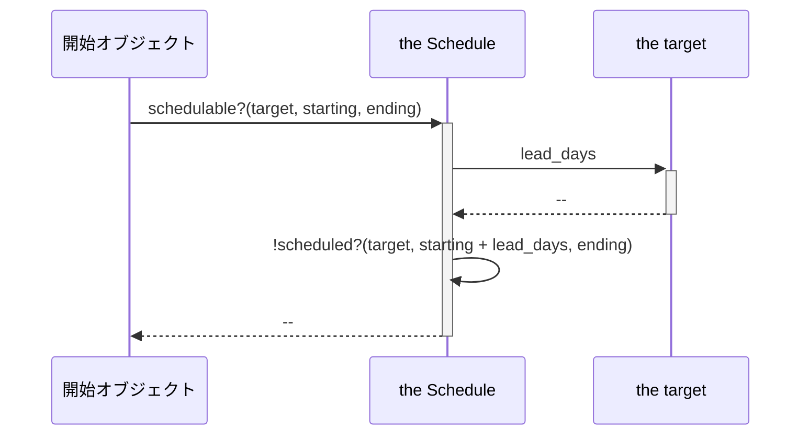
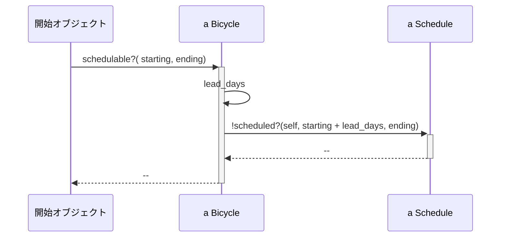
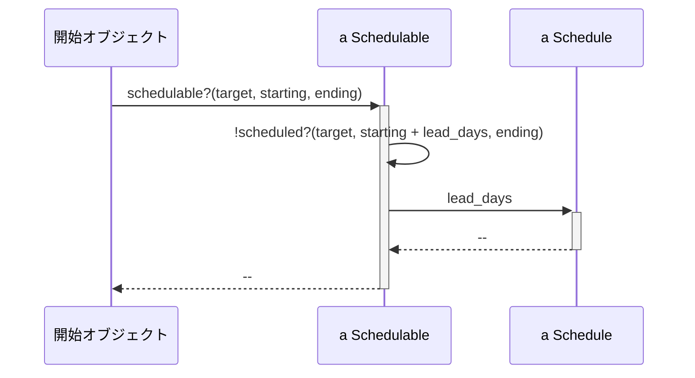

# モジュールでロールの振る舞いを共有する

継承の手法を使い「ロール（役割）」を共有する解決方について見ていく。

## ロールを理解する（７.１）

場合によっては、以前には関連のなかったオブジェクト同士に共通の振る舞いを持たせなければなりません。
この共通の振る舞いはクラスと直行します。

隠れたロールを明らかにし、その振る舞いをすべての担い手同士で共有するためのコードを書いていきます。

### ロールを見つける

Preparer ダックタイプはロールです。Preparer のインターフェースを実装するオブジェクトが Preparer ロールを担います。prepare_trip を実装しているため、その根底に歩くタスを気にすることなくどれも Preparer として関わることができます。

Preparer ロールの存在が示唆するのは、対応する Preparable ロールの存在です。
Trip クラスが Preparable の振る舞いをしました。つまり Preparable のインターフェースを実装していたのです。
Preparable のインターフェースには、Preparer が送るである bicycles、customers、vehicle メソッドのメッセージが全て含まれています。

複数のオブジェクトが Preparer ロールを担うにもかかわらず、このロール自体は実に簡潔で、インターフェースのみによって定義されます。オブジェクトは独自の prepare_trip を実装しさえすればこのロールを担えます。
Preparer のように振る舞うオブジェクトが共有するものはメソッドのシグネチャのみであり、そのほかのコードは全く共有しません。

モジュールは、さまざまなクラスのオブジェクトが、1 ヶ所に定義されたコードを使って共通のロールを担うための完璧な方法だと言えるでしょう。

オブジェクトが応答できるメッセージにの集合には、次の 4 種類のメッセージが含まれます。

- 自身が実装するメッセージ
- 自身より上の階層のすべてのオブジェクトで実装されるメッセージ
- 自身に追加される、すべてのモジュールで実装されるメッセージ
- 獅子 n より上の階層のオブジェクトに追加される、全てのモジュールで実装されるメッセージ

### 責任を管理する

旅行のスケジュールを立てることを考えてみましょう。旅行は自転車、整備士、自動車の 3 つを伴い、時間軸のどこかで発生します。自転車、整備士、自動車は物理世界に存在するものです。これらは同時に 2 箇所には存在できません。

ここでの要件は、旅行と旅行の間に必要な休息期間は、自転車が最低 1 日、自動車が最低 3 日間、整備士が 4 日間です。

Schedule う k ラスが存在すると仮定します。Schedule クラスのインターフェースには次の 3 つのメソッドがあるとしましょう。

```
scheduled?(target, starting, ending)
add(target, starting, ending)
remove(target, starting, ending)
```

オブジェクトが任意の期間にスケジュールされているかが分かれば、確かにその知識だけで、すでに予定が決まっているオブジェクトを二重にスケジュールしてしまうことは防げるでしょう。
しかし、任意の期間にオブジェクトがスケジュールされて「いない」とわかっても、期間内にオブジェクトをスケジュール「できる」かどうかを判断するための情報としては不十分です。
オブジェクトをスケジュールできるかどうかを適切に判断するためには、なんらかのオブジェクトがなんらかの時点で、リードタイムを考慮する必要があるのです。

shedulable?メソッドは、使われ得る値を全て知っています。そして引数として渡された target のクラスを確認しどのリードタイムを使うかを決定します。

その場合、どの「メッセージ」を送ればいいかを知るためにクラスを確認します。また、Schedule が、どの「値」を使えばいいかを知るためにクラスを確認しています。どちらにしても、Schedule は知識を持ちすぎています。
どのクラスにどの値を用いるかは各クラス（Schedule が確認する先のクラス）が持つべき。

### 不必要な依存関係を取り除く

**Schedulable ダックタイプを見つける**
新しいコードのシーケンス図
クラス名の確認を scheduleable?メソッドから取り除き、メソッドの代わりに lead_days メッセージを送るようにしました。
lead_days メッセージは引数で渡される target オブジェクトに送られます。
この変更により、オブジェクトにクラス名を聞いていた if 文がメッセ０時に取って代わられました。



上のシーケンス図で注目すべきは、「the target」とラベルがつけられた箱の存在です。
Schedule は lead_days メッセ０時を自身の target に送ろうとしています。しかし、target はいくつもあるクラスのどのインスタンスでもあり得ます。

Schedule が target に期待するものは、lead_days を理解するもの、すなわち、「schedulable（スケジュール可能）」なもののように振る舞うことです。

この新たに見つけたダックタイプは、現時点で、第 5 章の Preparer ダックタイプと形式上それほど変わりません。

**オブジェクト自身に自信を語らせる**
この新たに発見したダックタイプを使うことで、Schedule の特定のクラス名への依存が除去され、コードが改善されます。
しかし、まだ不必要な依存が残っています。

開始オブジェクトは、target オブジェクトがスケジュール可能かを確かめよとしていますが、残炎なことに target 自身に聞いていません。代わりに第三者である Schedule に聞いています。本当に関心があるのはそのターゲットであるのにも関わらず、開始オブジェクトには Schedule の知識が強制され、依存が生じています。
target は scheduable?に応答するべきです。この schedulable?メソッドは Schedulable ロールのインターフェースに追加されるべきでしょう。

### 具体的なコードを書く

現状では、Schedulable ロールのインターフェースは 1 つだけです。schedulable?メソッドをこのロールに追加するためには、いくつかコードを書く必要がありますが、そのコードがどこに属するべきかは少し考えただけではわかりません。
決めなければならないことは、「コードが何をすべきか」と「コードをどこにおくべきか」です。

まずは任意の具象クラスを 1 つ選び、scheduable?メソッドを直接そのクラスに実装します。
Bicycle はこれで自身の「スケジュール可能性（schedulability）に」について応答できるようになりました。



→ このパターンでは、Schedule で一元管理できるので、それもそれでありな気がする。。。

変更以前では開始オブジェクトは Schedule について知っている必要があり、それゆえ Schedule に依存していました。

このシーケンス図をコードに反映するのは簡単です。

```
class Schedule
  def schedule?(_shedulable, start_date, end_date)
    puts "This #{schedulable.class}" +
         "is not scheduled\n" +
         " between #{start_date} and #{end_date}"
    false
  end
end
```

次に Bicycle での schedulable?の実装を示します。スケジュールに必要なリードタイムは、Bicycle が自身で持っています。
そして、scheduled?を Schedulee 本体へと委譲しています。

```
class Bicycle
  attr_reader :schedule, :size, :chain, :tire_size

  # Scheduleを注入し、初期値を設定する
  def iniitialize(_args = {})
    @schedule = args = [:schedule] || Schedule.new
    # ...
  end

  # 与えられた期間（現在はBicycleに固有）の間
  # bicycleが利用可能であればtrueをかえす
  def schedulable?(start_date, end_date)
    !scheduled?(start_date - lead_days, end_date)
  end

  # scheduleの答えを返す。
  def sheduled?(start_date, end_date)
    schedule.scheduled?(self, start_date, end_date)
  end

  # bicycleがスケジュール可能となるまでの準備日数を返す
  def lead_days
    1
  end

  # ...
end
```

### 抽象を抽出する。

shcedulable?メソッドが何をするべきかは決まりました。しかし、「スケジュール可能（schedulable）」なオブジェクトは Bicycle だけではありませんでした。Mechanic、Vehicle もまた、このロールを担うので、この振る舞いを必要としています。
クラスが異なっても振る舞いを共有できるようにしていく。

新たに Schedulable モジュールを示します。
モジュールには上記の Bicycle クラスから抽象化したものが含まれます。

```

module Schedulable
  attr_writer :schedule

  def schedule
    @schedule ||= ::Schedule.new
  end

  def schedulable?(start_date, end_date)
    !scheduled?(start_date - lead_days, end_date)
  end

  def scheduled?(start_date, end_date)
    schedule.scheduled?(self, start_date, end_date)
  end

  # 必要に応じてインクルードする側で置き換える
  def lead_days
    0
  end
end
```

上記のコードでは、Schedule への依存は Bicycle から取り除かれ、Schedulable モジュールに移動されています。範囲が限定されたことで、依存はより隔離されました。
lead_days メソッドは￥モジュールの実装ではより一般的に疲れる初期値として０を返します。

このモジュールを次のコードのように元々の Bicycle クラスにインクルードすると、モジュールのメソッドが Bicycle のレスポンスの集合に追加されます。
この lead_days メソッドはフックであり、テンプレートメソッドパターンにならったものです。

```
class Bicycle
  include Schedulable

  def lead_days
    1
  end
end
```

他のオブジェクトはこのモジュールを利用して、自身を Schedulable にできるのです。
他のオブジェクトはコードを複製することなくロールを担えます。
メッセージのパターンも変わりました。
scheduulable? を Bicycle に送っていたものが、Schedulable に送るようになりました。



このモジュールをスケジュールされ得るすべてのオブジェクトにインクルードした後では、コードのパターンは一層継承らしくなります。
次のコードでは、Vehicle と Mechanic が Schedulable モジュールをインクルードし、schedulable?メソッドに応答しています。

```
class Bicycle
  include Schedulable

  def lead_days
    1
  end
end

class Vehicle
  include Schedulable

  def lead_days
    3
  end

  # ...
end

class Mechanic
  include Schedulable

  def lead_days
    4
  end

  # ...
end
```

Schedule のコードは抽象的です。それが提供するアルゴリズムの特化をオブジェクトに促すために、テンプレートメソッドパターンを使っています。
これらの Schedulable は、lead_days を上書きすることで特化し、地震に適した準備期間を用意します。

###　メソッド探索の仕組み
知っていたので省略
