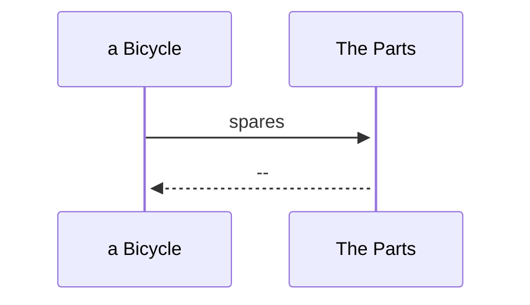
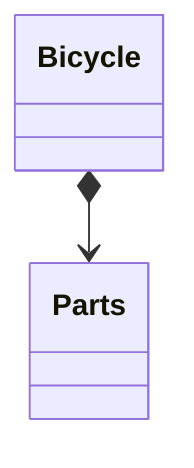
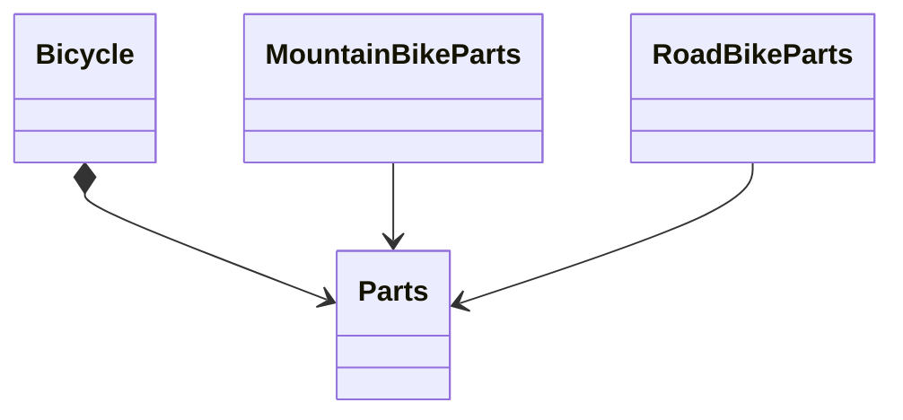

# コンポジションでオブジェクトを組み合わせる

コンポジションとは、組み合わされた全体が、単なる部品の集合以上となるように、個別の部品を複雑な全体へと組み合わせる（コンポーズする）行為です。
この章では。オブジェクト指向コンポジションのテクニックについて説明する。

## 自転車をパーツからコンポーズする（８.１）

リファクタリングをいくつか施しながら、次第に継承をコンポジションに置き換えていきます。

### Bicycle クラスを更新する

Bicycle クラスは、現在、継承の階層構造における抽象スーパークラスです。これをコンポジションをつくように変更したいとしましょう。
最初のステップは、まず今あるコードのことを忘れることです。そして自転車はどのようにコンポーズされるべきか考えてみましょう。

Bicycle クラスは、spares メッセージに答える責任があります。「自転車 − パーツ」といった関係がコンポジションであるということは、とても自然なことのように思えます。自転車のパーツ全てを持つオブジェクトを作れば、スペアパーツに関するメッセージはその新しいオブジェクトに移譲できるでしょう。
この新しいクラスを Parts クラスを名づけるのは妥当です。Parts オブジェクトは、自転車のパーツ一覧を保持しておくこと、また、どのパーツがスペアを必要とするのかを知っておく責任を負えます。



すべての Bicycle が Parts オブジェクトを必要とします。Bicycle であるということは、Parts を持つことを意味するのです。



この図は、Bicycle と Parats クタスは線で繋がっています。
あたらしい Bicycle クラスは次のようになるでしょう。

```
class Bicycle
  attr_reader :size, :parts

  def initialize(args={})
    @size = args[:size]
    @parts = args[:parts]
  end

  def spares
    parts.spares
  end
end
```

Bicycle の責任は 3 つになりました。size を知っていくこと、自身の Parts を保持すること、そして spares に応えること。

### Parts 階層構造をつくる

Bicycle のコードの大部分は、パーツを取り扱っていました。Bicycle からより除いた振る舞いは依然として必要なものです。
このコードが再度動くようにするための一番単純な方法は、次のコードのように、単純に Parts の新しい階層構造に対象のコードを移動することです。

```
class Parts
  attr_reader :chain, :tire_size

  def initialize(args = {})
    @chain = args[:chain] || default_chain
    @tire_size = args[:tire_size] || default_tire_size
    post_initialize(args)
  end

  def spares
    {
      tire_size: tire_size,
      chain: chain
    }.merge(local_spares)
  end

  def default_tire_size
    raise NotImplementedError
  end

  # subclasses may override
  def post_initialize(_args)
    nil
  end

  def local_spares
    {}
  end

  def default_chain
    '10-speed'
  end
end

class RoadBikeParts < Parts
  attr_reader :tape_color

  def post_initialize(args)
    @tape_color = args[:tape_color]
  end

  def local_spares
    {
      tape_color: tape_color
    }
  end

  def default_tire_size
    '23'
  end
end

class MountainBikeParts < Parts
  attr_reader :front_shock, :rear_shock

  def post_initialize(args)
    @front_shock = args[:front_shock]
    @rear_shock = args[:rear_shock]
  end

  def local_spares
    {
      rear_shock: rear_shock
    }
  end

  def default_tire_size
    '2.1'
  end
end
```



ここには抽象 Parts クラスがあります。
Bicycle は Parts から構成されます。Parts は RoadBikeParts と MountainBikeParts という 2 つのサブクラスを持ちます。￥

このリファクタリングを経ても、すべてこれまで通り動きます。
RoadBikeParts か MountainBikeParts のどちらを持とうが、自転車は依然として自信の size と spares を正確に答えられるのです。

これは大きな変更でもなく、大きな改善でもありません。しかし、このリファクタリングのよおっ絵、有益なことが明らかになりました。
そもそも必要だった Bicycle の特有のコードがいかに少なかったです。
Parts 階層構造は、また別のリファクタリングを必要としています。
