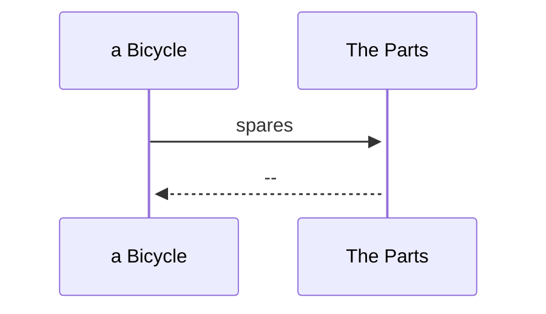
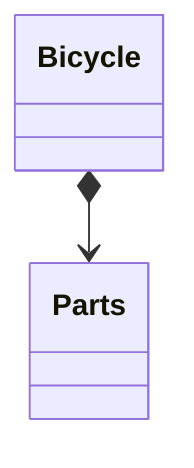
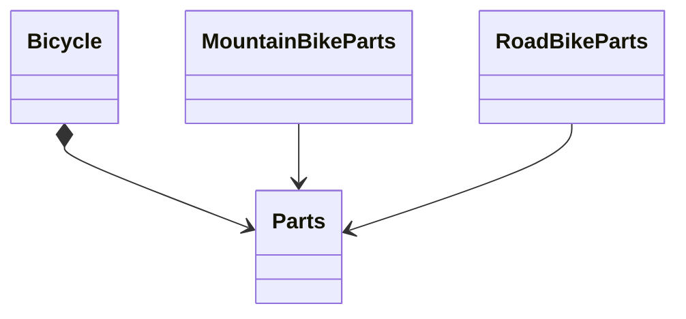
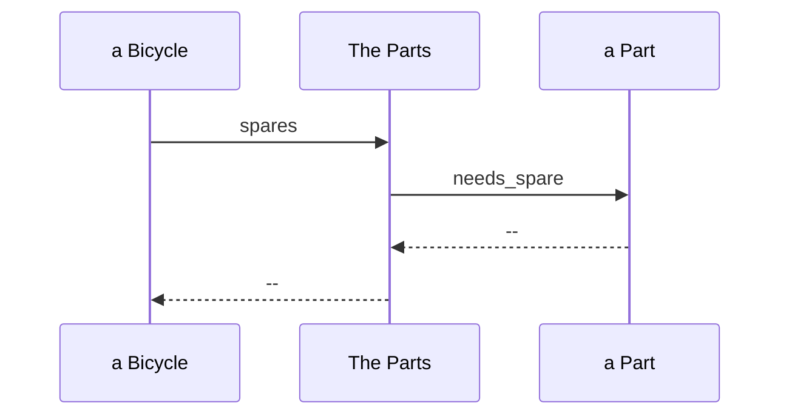
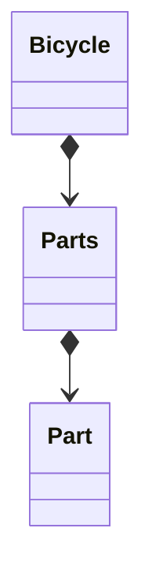

# コンポジションでオブジェクトを組み合わせる

コンポジションとは、組み合わされた全体が、単なる部品の集合以上となるように、個別の部品を複雑な全体へと組み合わせる（コンポーズする）行為です。
この章では。オブジェクト指向コンポジションのテクニックについて説明する。

## 自転車をパーツからコンポーズする（８.１）

リファクタリングをいくつか施しながら、次第に継承をコンポジションに置き換えていきます。

### Bicycle クラスを更新する

Bicycle クラスは、現在、継承の階層構造における抽象スーパークラスです。これをコンポジションをつくように変更したいとしましょう。
最初のステップは、まず今あるコードのことを忘れることです。そして自転車はどのようにコンポーズされるべきか考えてみましょう。

Bicycle クラスは、spares メッセージに答える責任があります。「自転車 − パーツ」といった関係がコンポジションであるということは、とても自然なことのように思えます。自転車のパーツ全てを持つオブジェクトを作れば、スペアパーツに関するメッセージはその新しいオブジェクトに移譲できるでしょう。
この新しいクラスを Parts クラスを名づけるのは妥当です。Parts オブジェクトは、自転車のパーツ一覧を保持しておくこと、また、どのパーツがスペアを必要とするのかを知っておく責任を負えます。



すべての Bicycle が Parts オブジェクトを必要とします。Bicycle であるということは、Parts を持つことを意味するのです。



この図は、Bicycle と Parats クタスは線で繋がっています。
あたらしい Bicycle クラスは次のようになるでしょう。

```
class Bicycle
  attr_reader :size, :parts

  def initialize(args={})
    @size = args[:size]
    @parts = args[:parts]
  end

  def spares
    parts.spares
  end
end
```

Bicycle の責任は 3 つになりました。size を知っていくこと、自身の Parts を保持すること、そして spares に応えること。

### Parts 階層構造をつくる

Bicycle のコードの大部分は、パーツを取り扱っていました。Bicycle からより除いた振る舞いは依然として必要なものです。
このコードが再度動くようにするための一番単純な方法は、次のコードのように、単純に Parts の新しい階層構造に対象のコードを移動することです。

```
class Parts
  attr_reader :chain, :tire_size

  def initialize(args = {})
    @chain = args[:chain] || default_chain
    @tire_size = args[:tire_size] || default_tire_size
    post_initialize(args)
  end

  def spares
    {
      tire_size: tire_size,
      chain: chain
    }.merge(local_spares)
  end

  def default_tire_size
    raise NotImplementedError
  end

  # subclasses may override
  def post_initialize(_args)
    nil
  end

  def local_spares
    {}
  end

  def default_chain
    '10-speed'
  end
end

class RoadBikeParts < Parts
  attr_reader :tape_color

  def post_initialize(args)
    @tape_color = args[:tape_color]
  end

  def local_spares
    {
      tape_color: tape_color
    }
  end

  def default_tire_size
    '23'
  end
end

class MountainBikeParts < Parts
  attr_reader :front_shock, :rear_shock

  def post_initialize(args)
    @front_shock = args[:front_shock]
    @rear_shock = args[:rear_shock]
  end

  def local_spares
    {
      rear_shock: rear_shock
    }
  end

  def default_tire_size
    '2.1'
  end
end
```



ここには抽象 Parts クラスがあります。
Bicycle は Parts から構成されます。Parts は RoadBikeParts と MountainBikeParts という 2 つのサブクラスを持ちます。￥

このリファクタリングを経ても、すべてこれまで通り動きます。
RoadBikeParts か MountainBikeParts のどちらを持とうが、自転車は依然として自信の size と spares を正確に答えられるのです。

これは大きな変更でもなく、大きな改善でもありません。しかし、このリファクタリングのよおっ絵、有益なことが明らかになりました。
そもそも必要だった Bicycle の特有のコードがいかに少なかったです。
Parts 階層構造は、また別のリファクタリングを必要としています。

## Parts オブジェクトをコンポーズする(8.2)

定義に基づけば、パーツのリストは、個々の部品を持ちます。
単一の部品を表すクラスを追加するときが来ました。

すでに単一の Parts クラスを参照するために「parts」という語が使われているところに複数の Part オブジェクトの集まりに言及するために「parts」を使うのは混乱の元です。

今は、Parts オブジェクトがあり、それが Part オブジェクトを複数保持できるだけとしてすすめましょう。

### Part を作る

Bicycle とその Parts オブジェクト間の会話、そして Parts オブジェクトとその Part オブジェクト間の会話です。
Bicycle は Parts に spares を送ります。そして Parts オブジェクトは needs_spare をそれぞれの Part に送ります。



設計をこのように変更すると、新たに Part オブジェクトを作る必要が出てきます。Parts オブジェクトはいまや複数の Part オブジェクトからコンポーズされるようになっています。



Bicycle は Part オブジェクトを１つ持ち、Parts は複数の Part を持つ。

この Part オブジェクトを新たに導入したことにより、既存の Parts クラスは簡略化され、Part オブジェクトの配列を包む簡潔なラッパーとなりました。Parts は自身の Part オブジェクトのリストを選別し、スペアが必要なものだけを返すことができます。

次のコードは既存の Bicycle、更新された Parts クラス、新たに導入された Part クラスです。

```
class Bicycle
  attr_reader :size, :parts

  def initialize(args = {})
    @size = args[:size]
    @parts = args[:parts]
  end

  def spares
    parts.spares
  end
end

class Parts
  attr_reader :parts

  def initialize(parts)
    @parts = parts
  end

  def spares
    parts.select { |part| part.needs_spare }
  end
end

class Part
  attr_reader :name, :description, :needs_spare

  def initialize(args)
    @name = args[:name]
    @description = args[:description]
    @needs_spare = args.fetch(:needs_sparem, true)
  end
end
```

これら 3 つのクラスが存在するようになったので、個々の Part オブジェクトを作れます。

```
chain = Part.new(
  name: 'chain', description: '10-spaeed'
)

road_tire = Part.new(
  name: 'tire_size', description: '23'
)

tape = Part.new(
  name: 'tape_color', description: 'red'
)

mountain_tire = Part.new(
  name: 'tire_size', description: '2.1'
)

rear_shock = Part.new(
  name: 'rear_shock', description: 'Fox'
)

front_shock = Part.new(
  name: 'front_shock', description: 'Manitou', needs_spare: false
)

```

個々の Part オブジェクトは、Parts オブジェクトにひとまとめにしてグループ化できます。

```
road_bike_part = Parts.new([chain, road_tire, tape])
```

以前の階層構造と異なるのは、Bicycle の以前の spares メソッドはハッシュを返しましたが、この変更後の spares メソッドは、Part オブジェクトの配列を返します。
これらのオブジェクトを Part クラスのインスタンスだと考えたくなるかもしれません。
しかし、コンポジションの教えによれば、これらは**Part のロールを担うオブジェクト**と考えるべきです。
これらのオブジェクトは「Part クラスの種類」である必要もありません。その 1 つであるかのように振る舞う必要があるだけです。
つまり、name、description、needs_spare に対応できる必要があります。

### Parts オブジェクトをもっと配列のようにする

このコードは改善の余地がある。
Bicycle の parts と spares メソッドは、同じ種類のものを返すべきな感じがします。しかし、今の時点では戻ってくるオブジェクトは同じように振る舞いません。

```
mountain_bike.spares.size
# -> 3
mountain_bike.parts.size
# -> NoMethodError:
      undifiend method 'size' for #<Parts:...>
```

parts は Parts のインスタンスを返すため size を理解できません。
この 2 つは両方とも配列のように見え、故に配列のように扱ってしまいます。
直近の問題は、Parts に size メソッドを追加することで修正できます。単純に size を委譲するメソッドを実装するだけです。

```
def size
  parts.size
end
```

この変更を加えると、Parts に対して、each や sort しまいには Array とすべてのメソッドに応答して欲しくなります。
Parts を配列のようなものにすればするほど、より配列のように振る舞うことを期待するようになるのです。
Array である Parts をつくることもできる。

```
class Parts < Array
  def spares
    select { |part| part.needs_spare }
  end
end
```

上のコードはかなりストレートな方法で、Parts は Array を特化したものであるという考えを形にしたものです。
この設計には欠陥が隠れています。

```

Part は'+'を Array から継承するため、2 つの Parts は加え合わせられる。
combo_parts =
(mountain_bike.parts + road_bike.parts)

'+'は間違いなく Parts を組み合わせる
combo_parts.size -> 7

しかし、'+'が返すオブジェクトは'spares'を理解できない。
combo_spares.spares
-> NoMethodError: undifiend method 'spares'
for #<Array:...>

mountai_bike.parts.class -> Parts
road_bike.parts.class -> Parts
combo_parts.class -> Array

```

Array には新しい配列を返すメソッドは沢山あり、これらのメソッドは、Array クラスのインスタンスを返すのであり、こちらで定義したサブクラスのインスタンスを返すのではありません。
ここまで、それぞれ異なる Parts の実装を 3 つ見てきました。最初の実装が応えるのは spares と parts メッセージのみでした。配列のようには振る舞いません。ただ配列をもっているだけです。
2 つ目の parts の実装では、size を追加しました。内部配列の size を返すようにしただけでした。
最後の Parts の実装では、Array のサブクラスにしました。したがって、見かけ上は、最大限配列オブジェクトのように振る舞うようになりました。
しかし、上記の例に見られるように Parts のインスタンスはまだ期待はずれの振る舞いをします。

以上から、完璧な解決方法はないことが明らかになりました。難しい決断が迫られています。

複雑さと利便性のおおよそ中間に、次の解決策があります。
次の Parts クラスは size と each を自身の@parts 配列に委譲し、操作と検索のための共通メソッドを得るために。Enumerable をインクルードしています。
このバージョンの Parts は Array の振る舞いを全てもつわけではありません。
しかし、少なくとも Parts ができると主張することはすべて実際に動作します。

```

require 'forwardable'
class Parts
  extend Forwardable
  def_delegators :@parts, :size, :each

  iclude Enumerable

  def initialize(parts)
    @parts = parts
  end

  def spares
    select { |part| part.needs_spare }
  end
end

```

この Parts インスタンスに＋を送ると、NoMethodError 例外が起きます。しかし、Parts は現在、size、each、そして、Enumerable の全てに応答するようになっていて、間違って Array のように扱った時にのみエラーを発生するようになっています。

再度、動くバージョンの Bicycle、Parts、Part クラスを手に入れました。では、設計を再評価してみましょう。
