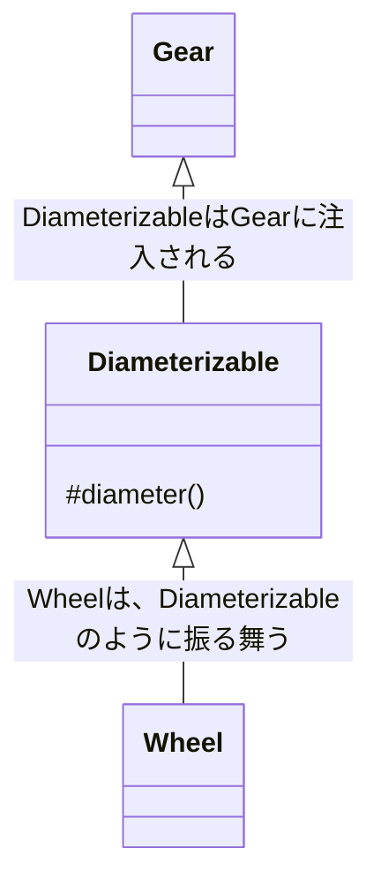

# 費用対効果の高いテストを設計する

変更可能なコードを書くことは１つの技巧であり、その実践には３つのスキルが欠かせません。
１つ目はオブジェクト指向設計の理解です。
２つ目はコードのリファクタリングに長けていることです。
　「リファクタリングとは、**ソフトウェアの外部の振る舞いを保ったまま**で。内部の構造を改善していく作業を指します。
３つ目は価値の高いテストを書く能力

## 意図を持ったテスト（9.1）

**テストをすることの真の目的は、コストの削減です。**
テストにコストがかかることの解決方法は、テストを止めることではありません。上手くなることです。
テストか優れた価値を得るには、意図の明確さが求められます。

### テストの意図を知る

テストの実施には、潜在的な利益がいくつもあります。

■ バグを見つける
欠陥やバグを開発プロセスの初期段階で見つけることは、大きな利益となって返ってきます。
バグの発見と修正は、それがつくられた時間に近ければ近いほどより簡単です。

できること（できないこと）を初期段階で知ることは、将来利用可能な設計の選択肢を変えるために、いまの案ではない他の案を選択し直すきっかけとなることもあるでしょう。

■ 仕様書となる
テストは、唯一信頼できる設計の仕様書となります。
テストが伝える説明は、紙の文章が過去のものとなり、人間の記憶がなくなってずっとたったあとでも、真であり続けます。

■ 設計の決定を遅らせる
テストによって、設計の決定を遅らせることができます。
自身の設計スキルが磨かれるにつれ、ここの設計には「何か」が必要だけど、それが正確に何なのかを知るためにはまだ十分な情報がない、というような箇所が散見されるアプリケーションを描くようになります。それらは、追加の情報を待つべきであり箇所であり、具体的な設計にしなければならないという押し付けには勇気を持って抵抗すべきです。

**こういった状況が生じるのは、現時点ではただ 1 つの具体的なケースにのみ気づいているものの、複数の具象的なケースが近い将来新たに現れることを十分に予期している時のみです。それらのいくつもの具象的なケースを単一の中傷として扱うコードによって、いつか報われるときが来ることは知っているものの、現時点では、その抽象がどんなものになるのか予測するための十分な情報がない**のです。

テストがインターフェスに依存している場合、その根底にあるコードは、奔放にリファクタリングできます。テストは、そのインターフェースが正しく振る舞い続けることを証明するので、根底にあるコードを変更しても、テストの書き直しが求められることはありません。

■ 抽象を支える
良い設計は自然と抽象に依存する、独立した小さなオブジェクトの集まりになっていきます。
適切に設計されたアプリケーションの振る舞いは、徐々にそれらの抽象が相互に作用した結果となっていきます。
抽象的なコードは、素晴らしく柔軟性に富む設計のコンポーネントですが、それらがもたらす改善は、わずかにコストを伴います。個々の抽象は理解しやすいものの、全体の振る舞いを明らかにする箇所は、1 つとしてないのです。

設計の抽象度合によっては、どんな変更であっても、テストなしで安全に行うことがほぼ不可能になります。
テストは、あらゆる抽象のインターフェースを記録するものであり、従って、背後を守ってくれる壁のようなものです。

■ 設計の欠陥を明らかにする
対象のコードの、設計の欠陥を明らかにすることです。
テストのセットアップに苦痛が伴うのであれば、コードはコンテキストを要求しすぎています。1 つのオブジェクトをテストするために、他のオブジェクトをいくつも引き込まなければならないのであれば、そのコードは依存関係を持ちすぎています。テストを書くのが大変であれば、他のオブジェクトから見ても再利用が難しいでしょう。

しかし、その逆も必ずしも真ではありません。テストにコストがかかるからといって、必ずしもアプリケーションの設計がまずいわけではありません。
適切に設計されたコードに、出来の悪いテストを書くことは、技術上十分にあり得ます。従って、コストを下げるテストを実現するためには、対象のアプリケーションとテストの、両方を適切に設計する必要があります。

目標は、可能な限り低いコストでテストの恩恵を全て得ることです。
この目標を達成するための最適な方法は、問題となることのみをテストする、疎結合のテストをすることです。

■ 何をテストするのかを知る
ほとんどのプログラマーはテストを書きすぎています。多くの場合、これら不要のテストにかかるコストはとても高く、関わっているプログラマーがテストを s きらめてしまうほどです。
テストからより良い価値を得るための 1 つの単純な方法の 1 つは。より少ないテストを書くことです。最も安全にこれを実現するには、どのテストも一度だけ、それも適切な場所で行うようにしましょう。

テストをその本質へと抽出するには、何をテストしようとしているかについて、明確な考えを持っていなければなりません。それは、すでに知っている設計原則から導くことができます。

オブジェクト指向のアプリケーションを、ブラックボックスの集まりの間を飛び回る一連のメッセージだと考えてみましょう。どのオブジェクトもブラックボックスであるかのように扱うことで、他のオブジェクトが知ることを許される知識について制約が課されます。そして、公開される（パブリックな）知識についても、その境界を突き放すメッセージのみへと制限されます。

この、ほかのオブジェクトの内部を意図的に無視することが、設計の核心にあります。オブジェクトを、オブジェクトが応答するメッセージそのもの、かつそれだけであるかのように扱うことで、変更可能なアプリケーションを設計することができます。そして、この観点の重要性を理解して初めて、最低限のコストで最大限の利益を生むテストをかけるようになるのです。

結合は数を制限するだけでは十分ではありません。数をわずかにとどめたうえで、安定したものにすべきです。論理的に考えれば、パブリックインターフェースに定義されるメッセージを対象としたものを書くべきということがわかります。最もコストが高く最も利用性の低いテストは、不安定な内部の実装に結合することで、オブジェクトの格納壁に穴を開けます。それらの貪欲すぎるテストは、アプリケーション全体の正しさについても何も証明しないどころか、対象のクラスをリファクタリングするたびに毎回壊れるせいで、コストを高めてしまいます。

**テストは、オブジェクトの境界に入ってくる（受信する）か、出ていく（送信する）メッセージに集中すべきです。**受信メッセージは、それを受け取るメッセージのパブリックインターフェースを作ります。送信メッセージは、その定義上当然、他のオブジェクトに入っていきます。ですから、それは他のオブジェクトのインターフェースの一部です。

送信メッセージの状態をテストする必要がないからといいて、それらをテストしなくてよいという訳ではありません。
送信メッセージには 2 種類あ理、そのうちの 1 つは、別の種類のテストを必要とします。

送信メッセージには、副作用が全くないものもあります。そのため、そういったメッセージは送り手だけにとって問題となります。送り手は、もちろんその戻り値を気にします。しかし、アプリケーションの他のところでは、そのメッセージが送られたかなど気にしません。このような送信メッセージは、「クエリ（質問）」として知られていて、送り手のオブジェクトでテストされる必要はありません。

しかし、多くの送信メッセージは、アプリケーションが依存するものに対して副作用（ファイルの書き込みや、データベースへの記録の保存、オブザーバーによってアクションが起こされるなど）を持ちます。これらのメッセージは「コマンド（命令）」であり、それらが適切に送られたことを証明するのは送り手のオブジェクトの責任です。メッセージが送られたことの証明は、振る舞いのテストであり、状態のテストではありません。振る舞いのテストには、メッセージが送られた回数と、使われた引数についての表明が含まれます。

**何をテストするかのガイドラインは以下のようになります。**
受信メッセージは、その戻り値の状態がテストされるべきです。送信コマンドメッセージは、送られたことがテストされるべきです。送信クエリメッセージは、テストするべきではありません。
アプリケーションのオブジェクトが、互いに厳しくパブリックインターフェースのみを介して対処する限り、テストは上記のこと以外を把握する必要はありません。メッセージの最小限の集合に対してテストをするならば、どのオブジェクトのプライベートな振る舞いを変更してもテストに影響を与えることはないでしょう。送信コマンドメッセージをテストするとき、送られることのみを証明するためにテストを行うのであれば、結合が緩いテストになります。そしてその疎結合のテストは、アプリケーションの変更に対しても、テストが変更されることなく、耐えることができるでしょう。パブリックインターフェースが安定している限り、テストを一度書けば、書いた人はテストにより永遠に安心していられます。

### いつテストをするかを知る

テストを最初に書くと、オブジェクトに初めから多少の再利用性を持たせることになります。というよりも、そうでもしないとテストは全く書けないのです。そのため、初級の設計者はテストファーストでコードを書くことが最も有益です。
しかし、気をつけなければならないこともあります。テストを最初に書いても、適切に設計されたアプリケーションの代替にも保証にもなりません。

### テストの方法を知る

異なる様式のテスティングにも取り組まなければなりません。テスト駆動開発（TDD：Test Driven Devlelopment）と振る舞い駆動（BDD：Behavior Driven Development）があります。ここの決定は、それほど明快にできません。
TDD と BDD は対立するものであるように見えるかもしれませんが、連続体として見るのが最もよいでしょう。ここでは、自身の価値観と経験が自ずと自身の立ち位置を決めます。

どちらの様式も、テストファーストによってコードを書いていきます。
BDD は外から内へのアプローチをとり、アプリケーションの境界でオブジェクトを作り、内向きに入っていきます。まだ書かれていないオブジェクトを用意するために、モックが必要となります。
TDD は内から外へのアプローチをとります。通常、ドメインオブジェクトのテストから始まり、それたの新しく作られたドメインオブジェクトをコードの隣接するレイヤーのテストで再利用していきます。

テストをするときには、アプリケーションのオブジェクトを大きく 2 つのカテゴリに分けて考えることが役に立ちます。1 つ目のカテゴリーは、自身がテストするオブジェクトです。以降、これを「テスト対象オブジェクト」と呼びましょう。2 つ目のカテゴリーは、その他のもの全てです。
テストは、1 つ目のカテゴリーに従事するもの、つまい、テスト対象オブジェクトを知っている必要があります。しかし、2 つ目のカテゴリーのものについては、テストは可能な限り無知であるべきです。アプリケーションの他の部分はまるで見えないかのように装いましょう。テスト中に利用可能な情報は、テスト対象オブジェクトを見ることによってのみ得ることができるものであると考えるのです。

## 受信メッセージをテストする(9.2)

受信メッセージは、オブジェクトのパブリックインターフェースを構成します。外の世界へ示す顔（face）です。アプリケーションの他のオブジェクトが、そのシグネチャと戻り値に依存しているため、これらのメッセージはテストを必要とします。

### 使われていないインターフェースを削除する受信メッセージには、必ずそこに依存するものがあります。

テスト対象オブジェクトに対してこの表を作ってみたとき、依存されてなさそうな受信メッセージが見つかったならば、そのメッセージに対して厳しく疑いの目を向けるべきです。誰も送りもしないメッセージを実装していることによって達成される目的は何かあるでしょうか。
「受信する」ことが本当に全くないのであれば、それは推測による実装です。未来を推測した臭いが漂う実装であり、明らかに、存在していない要件を予期したものです。
依存されていない受信メッセージをテストしてはいけません。そのメッセージは削除しましょう。

### パブリックインターフェースを証明する

受信メッセージは、その実行によって戻される値や状態を表明することでテストされます。受信メッセージをテストするにあたり、第一に求められることは、考えうる全ての状況において正しい値を返すことを証明することです。

次のコードは、Wheel の diameter メソッドのテストです。４行目で Wheel のインスタンスを作成し、６行目で Wheel の diameter が 29 であることを表明しています。

```
class WheelTest < MiniTest::Unit::TestCase
  def test_calculates_diameter
    wheel = Wheel.new(26, 1.5)

    assert_in_delta(29,
                    wheel.diameter,
                    0.01)
  end
end
```

（テスト対象のコードは以下の通り。）

```
class Wheel
  attr_reader :rim, :tire

  def initialize(rim, tire)
    @rim = rim
    @tire = tire
  end

  def diameter
    rim + (tire * 2)
  end

  # ...
end

class Gear
  attr_reader :chainring, :cog, :rim, :tire

  def initialize(args)
    @chainring = args[:chainring]
    @cog = args[:cog]
    @rim = args[:rim]
    @tire = args[:tire]
  end

  def gear_inches
    ratio * Wheel.new(rim, tire).diameter
  end

  def ratio
    chainring / cog.to_f
  end

  # ...
end
```

このテストは極度に単純なもので、実行するのはとても小さなコードです。Wheel は、隠された依存は何も持たないので、このテストを実行しても、その副作用によってこのほかにアプリケーションのオブジェクトが作られることはありません。Wheel の設計によって、アプリケーションに存在する他の全てのクラスから独立して Wheel をテストできるようになっています。
(→ 副作用という言葉は、次の GearTest と比べるとよく理解できる。)

Gear のテストはさらにもう少し興味深いものです。Gear は Wheel よりもわずかに多くの引数を要求します。しかし、そうであるにもかかわらず、これら 2 つのテストの全体的な構成はとても似通っているのです。次の gear_inches のテストでは、４行目にて Gear の新しいインスタンスを作成し、10 行目にてメソッドの戻り値について表明します。

```
class GearTest < MiniTest::Unit::TestCase
  def test_calculates_gear_inches
    gear = Gear.new(
      chainring: 52,
      cog: 11,
      rim: 26,
      tire: 1.5
    )

    assert_in_delta(137.1,
                    gear.gear_inches,
                    0.01)
  end
end
```

この新しい gear_inches のテストは、Wheel の diameter のテストにそっくりです。しかし、見た目に騙されてはいけません。このテストには、diameter テストには無かった絡まりがあります。Gear の gear_inches の実装は無条件に別のオブジェクト（Wheel）を作り、それを使うようになっています。**Gear と Wheel はコードとテストの両方で結合されていますが、ここでは明らかではありません。**

Gear の gear_inches メソッドが他のオブジェクトを作成し、使用するという事実は、2 つの影響を及ぼします。1 つはテストの実行時間です。もう一つは、アプリケーションに関連しない箇所の変更によって生じる予想外の結果に苦しむことになる可能性です。
しかし、この問題を生み出す結合は、Gear の内部に隠されています。それゆえ、このテストでは全く見ることができません。このテストが目的とすることは、gear_inches が正しい値を返すことと、それが確かに要件を満たすことの証明です。しかし、対象のコードの構成によって、隠れたリスクも追加されています。

Wheel の作成コストが高い場合、Gear のテストは、たとえ Wheel に関心がなくてもそのコストを払うことになります。Gear は正しいけれど、Wheel が壊れている場合、Gear のテストは誤解を招くような形で、テストをしようとしているコードから遠く離れたところで失敗するかもしれません。

テストは最低限のコードを実行する場合に、最速で終わります。そして、テストが実行する外部のコードの量は、設計に直接関係します。密に結合され、依存でいっぱいのオブジェクトから構成されるアプリケーションは、まるでタペストリーのようであり、一本の糸を引っ張ると全体が引きづられる絨毯のようです。密に結合されたオブジェクトのテストでは、1 つのオブジェクトのテストによって、たくさんのオブジェクトのコードが実行されます。Wheel のコードも他のオブジェクトに結合しているようであれば、問題はさらに拡大されることでしょう。

これらの問題はテストで現れましたが、テスト固有の問題ではありません。テストはコードの最初の再利用です。ですから、この問題は、アプリケーション全体の問題として起きることの予兆なのです。

### テスト対象のオブジェクトを隔離する。

Gear は簡素なオブジェクトですが、gear_inche メソッドのテストを試みたことで、隠れた複雑さが明らかになりました。このテストの目的は、gear_inches が正しく計算されることの保証でしたが、蓋を開けてみれば、その gear_inches メソッドの実行は、Gear 以外のオブジェクトのコードに頼っていたのです。

これは広範囲に及ぶ設計の問題を表しています。Gear を独立してテストできないときは、未来への悪い前兆が示されています。Gear が特定のコンテキストに結びついており、しかも制限を強要し、再利用の妨げとなるコンテキストに結び付けられていることがわかるのです。

第 3 章で、Wheel の作成を Gear から取り除くことによってこの結合を解きました。これで、Gear は diameter を理解するオブジェクトが注入されることを想定するようになりました。

```
class Gear
  attr_reader :chainring, :cog, :wheel

  def initialize(args)
    @chainring = args[:chainring]
    @cog = args[:cog]
    @wheel = args[:wheel]
  end

  def gear_inches
    # wheel変数内のオブジェクトがDiameterizableロールを担う。
    ratio * wheel.diameter
  end

  def ratio
    chainring / cog.to_f
  end

  # ...
end
```

このコードの遷移は、思考の遷移と並行しています。Gear はもはや注入されるオブジェクトのクラスについて気にしなくなり、単に diameter が実装されている k とのみを想定しています。
この diameter メソッドは、Diameterizable と呼ぶのが相応しいであろう「ロール」のパブリックインターフェースの一部となったのです。

Gear が Wheel から切り離されたので、Gear を作るときは毎回 Diameterizable を注入する必要があります。しかし、Wheel はアプリケーションにおいてこのロールを担う唯一のクラスなので、実行時の選択肢は著しく限られています。現実には、現在のコードがそうであるように、Gear を作るときにはいつでも wheel のインスタンスを注入する必要があるでしょう。

Gear へ Wheel を注入するか、Diameterizable を注入するかは、見かけほど同じではありません。
受信オブジェクトのクラスに縛り付けらた想像力を自由にすることで、設計と「テスト」における、それまでになかった可能性が開かれるのです。注入されるオブジェクトがそのロールのインスタンスだと考えることによって、テスト中に Gear へ注入する Diameterizable の種類について、より多くの選択肢を考えられるようになります。

考えられる Diameterizable の 1 つは、言うまでもなく Wheel です。正しいインターフェースを明確に実装しているからです。

```
class GearTest < MiniTest::Unit::TestCase
  def test_calculate_gear_inches
    gear == Gear.new(
      chinring: 52,
      cog: 11,
      wheel: Wheel.new(26, 1.5)
    )

    assert_in_delta(137.1,
                    gear.gear_inches,
                    0.01)
  end
end
```

注入される Diameterizable として Wheel を使うと、実際のアプリケーションを正確に反映したテストコードができます。Gear が Wheel を使っていることは、アプリケーションとテストにおいて、今や明白になっています。

### クラスを使って依存オブジェクトを注入する

テストコードでもアプリケーションコードであ、同じオブジェクトと協力していれば、テストはいつでも壊れるべきときに壊れます。この価値を甘く見ることはできません。
次にシンプルな例を示します。Diameterizable のパブリックインターフェースが変わることを考えてみましょう。あるプログラマーが Wheel クラスを触りに行き、diameter メソッドの名前を width に変えます。

```
class Wheel
  attr_reader :rim, :tire

  def initialize(rim, tire)
    @rim = rim
    @tire = tire
  end

  def width # <-- 以前は diameterだった
    rim + (tire * 2)
  end

  # ...
end
```

さらに、このプログラマーは、Grar 内にて送られるメッセージの名前を更新しわれたとしましょう。Gear は自身の gear_inches メソッド内で、依然として diameter を送っています。Gear の現在のコードの次に部分にある通りです。

```
class Gear
  def gear_inches
    ratio * wheel.diameter # <-- 古くなっている。
  end
end
```

Gear のテストは Wheelno インスタンスを注入しています。Wheel が実装するのは width ですが Gear は diameter を送るので、テストは失敗するようになります。

この失敗は驚くものではありません。2 つの具象的なオブジェクトが協力しているときに、メッセージの受け手が変わったのに送り手が変わっていないときに起こることです。Wheel が変わったので、Gear も変わる可能性があります。このテストは失敗するべくして失敗しています。

このテストはコードがとても具象的であるため、単純で失敗も明確です。しかし、全ての具象がそうであるように、これはこの特定の場合にしか動作しません。抽象を用意し、そのテストをした方がより効果を得られる場合も当然あるでしょう。

より極端な例では、問題が浮き彫りになります。何百もの Diameterizable があったとしましょう。テストで注入するには、最も意図を明確に伝えられるのはどれなのかを、どのように決めればよいでしょう。
Diameterizable のコストが極めて高い場合、どのようにして、大量の、不必要で時間を浪費するコードの実行を避けることができるでしょうか。

### ロールとして依存オブジェクトを注入する

Wheel クラスと Diameteraizable というロールは、それぞれが独立した概念だと捉えることが難しいほど、とても近くに並んでいます。しかし、前のテストで起きたことを理解するには、区別をつけなければなりません。Gear と Wheel は両方とも第三のものと関連しています。
Diameterizable というロールです。Diameterizable は Gear から依存され、Wheel によって実装されています。



このロールは、全く異種のオブジェクトも直径（diameter）を持てるという概念の抽象化です。

コード中には、2 箇所、オブジェクト Diameterizable の知識に依存している部分があります。
1 つ目は Gear です。Gear は自身が Diameterizable のインターフェースを知っていると思っています。Gear は注入されたオブジェクトに diameter を送れると信じているのです。
2 つ目は、注入されるオブジェクトを作った箇所のコードです。ここでは、Wheel がこのインターフェースを実装していると信じています。つまり、
Wheel が diameter を実装していることを想定しています。

ここで、Diameterizable に変更が加わると、問題が発生します。Wheel は新しいインターフェースを実装するように変更するように更新されたのですが、Gear は依然として古いインターフェースを想定したままなのです。

「依存オブジェクトの注入」の本質は、それにより、既存のコードを変更することなく異なる具象クラスへの差し替えができるようになることです。既存のロールを担う新しいオブジェクトを作り、ロールが求められるところへそれらのオブジェクトを注入することによって、新たな振る舞いを組み立てられます。
オブジェクト指向設計が**依存オブジェクトの注入を勧めるのは、具体的な具象クラスは一連のロールよりも多様になると信じているからです**。逆の言い方をすれば、**ロールは抽象化のもととなったクラスよりも安定したものになると信じている**のです。

この例で変わったのは、注入されたオブジェクトのクラスではなく、ロールのインターフェースです。Wheel を注入するのは依存として正しいことですが、その Wheel に diameter を送ることは、もはや正しくはないでしょう。
（→ オブジェクト指向設計では、ロールの方が安定的で、ロールに対して依存するように依存性を作る。結果として、具象クラスを変更してもロールに依存しているので問題ない。今回の例では、ロールのインターフェースを変更しており、それが概念と異なるということ。）

ロールの担い手が 1 つしかいない場合、その 1 つの具象的な担い手と抽象的なロールは、その境界が簡単にぼやけるほどに近接しています。

アプリケーションコードがただ一つの方法でしか書かれないのであれば、その構成をそのまま反映することが、最も効果的にテストを書く方法である場合もあるでしょう。こうすることによって、具象（Wheel）、抽象（diameter メソッドへのインターフェース）にかかわらず、どちらへの変更にも正しくテストが失敗します。

しかし、いつでもこのようにはできません。ときには、テスト内で Wheel の使用を控えたくなることもあるでしょう。アプリケーションにいくつもの異なる Diameterizable があれば、理想的なものを 1 つ作り、テストがロールの概念を明確に伝えるようにしたくなるかもしれません。Diameterizable のどれもが高コストなのであれば、コストの低いフェイクを 1 つ作って、テストの実行を早くしたくなるでしょう。BDD に取り組んでいれば、ロールを担うオブジェクトをまだ実装していないこともあります。その場合はテストを書くためだけに「何か」を作らなければならないでしょう。

■ テストダブルを作る
次の例では、Diαmeterizable のロールを担うフェイクオブジェクト、すなわち、「テストダブル」を作るという案を検討していきます。このテストでは、Diameterizable のインターフェースは元の diameter メソッドに戻されたとしましょう。２行目で作っている小野が、フェイクである DiameterDouble です。3 行目にて、このフェイクを Gear へ注入しています。

```
# Diameterizableロールの担い手を作る
class DiameterDouble
  def diameter
    10
  end
end

class GearTest < MiniTest::Util::TestCase
  def test_calculates_gear_inches
    gear = Gear.new(
      chainring: 52,
      cog: 11,
      wheel: DiameterDoubl.new
    )

    assert_in_delta(47.27,
                    gear.gear_inches,
                    0.01)
  end
end
```

テストダブルとは、ロールの担い手を様式化したインスタンスであり、テストでのみに使われるものです。考えられるすべての状況に対してこのようなダブルを作ろうとも、それを阻害するものは何もありません。関心のある機能を 1 つ強調し、オブジェクトの他の詳細は背景へと減退させます。
このタブルは、diameter を「スタブ」します。つまり、あらかじめ詰められた答えを返す diameter を実装します。DiameterDouble はかなり限定的ですが、それこそが肝心な点です。diameter がいつでも 10 を返すという事実が、まさにうってつけなのです。

このタブルを注入することで Gear のテストを Wheel クラスから切り離せます。 DiameterDouble は常に早いので、もはや Wheel が遅いかどうかは問題となりません。このテストはテストダブルを使っています。それゆえ簡潔で、早く、隔離されている上に、意図を明確に表します。

■ 夢の世界に生きる
いま一度、前と同じ変更がコードに加わるとしましょう。Diameterizable のインターフェースは diameter から width に変わり、Wheel は変更されましたが、Gear はそのままです。この変更は、再度アプリケーションを壊します。以前の Gear のテストはこの問題にすぐに気づき、undifined 　 method diameter エラーをお出して失敗するようになりました。

しかし、今は DiameterDouble を注入しているので、テストを再実行したときには、次のようなことが起こります。

```
GearTest
  PASS test_calculate_gear_inches
```

該当のテストは、アプリケーションが壊れていうのにも関わらず「通り続け」ます。このアプリケーションは動くはずがありません。Gear は diameter を送りますが、Wheel が実装しているのは width です。
異なる世界を作ってしまいました。アプリケーションははっきりと間違っているのにも関わらず、テストは呑気に、すべてうまくいっていると報告します。このような世界を作ってしまう可能性があるゆえに、スタブ（とモック）はテストを脆くすると警告する人がいるのです。しかし、ここでの失敗は、プログラマーの問題です。ツールのせいではありません。この問題の根本原因を理解する必要があります。そのためにも、コードのコンポーネントをさらにみていく必要があるでしょう。

このアプリケーションは Diameterizable というロールを含みます。このロールの担い手は、もともと wheel1 つだけでした。GearTest が Diameterizable を作ったときに「ロールの 2 つ目の担い手」が導入されました。あるインターフェースが変更されると、そのロールの担い手は例外なくその新しいインターフェースに適応する必要があります。しかし、テストように特別に作られたロールの担い手は実に簡単に見過ごされてしまいます。Wheel は新しいインターフェースに更新されましたが、DiameterDouble は更新されませんでした。

■ テストを使ってロールを文書化する
この問題が生じることに驚きはありません。このロールはほとんど目に見えないのです。「ここで Diameterizable を定義しているよ」と示せる場所はアプリケーションのどこにもありません。
このロールの可視性を高める方法の 1 つは、Wheel がそれを担うことを表明することです。次のコードの６行目では、まさにそうしています。ロールを文書化し、Wheel が正しくインターフェースを実装していることを証明しています。

```
class WheelTest < MiniTest::Unit::TestCase
  def setup
    @wheel = Wheel.new(26, 1.5)
  end

  def test_implements_the_diameterizable_interface
    assert_respond_to(@wheel, :diameter)
  end

  def test_calculates_diameter
    wheel = Wheel.new(26, 1.5)

    assert_in_delta(29,
                    wheel.diameter,
                    0.01)
  end
end
```

test_implements_the_dimaterizable_interface テストは、ロールに対するテストといいう案を導入していますが、完全に満足のいく解決方法ではありません。
まずこのテストは他の Diameterizable と共有できません。次に、Gear テストの「夢の世界に生きる」問題に対しては何の助けにもなりません。Wheel がこのロールを担うということを表明しても、Gear の DiameterDouble が過去のものになってしまい、gear_inches テストが間違って通ってしまうことは防げないのです。

ここでは、ロールにはそれ自体のテストが必要だと認識するだけで十分です。

## プライベートメソッドをテストする（9.3）

ときどき、テスト対象オブジェクトは自分自身にメッセージを送ります。self に送られるメッセージは、受けてのプライベートインターフェースに定義されているメソッドを実行します。

### テスト中ではプライベートメソッドを無視する

プライベートメソッドのテストをしないことを指示する理由。
1 つ目に、そのようなテストは冗長です。プライベートメソッドはテスト対象オブジェクト内に隠されていて、その結果は他のオブジェクトから見ることはできません。プライベートメソッドは、パブリックメソッドによって実行され、プライベートメソッドのバグは、（パブリックメソッドの）テストの失敗によって顕になります。
2 つ目にプライベートメソッドは不安定です。そのため、プライベートメソッドのテストは、アプリケーションコードの変わりやすいところへの結合なのです。不必要なテストの継続的なメンテナンスをするためにコストを払う必要がある。
3 つ目に、プライベートメソッドのテストをすることで、他のメソッドがそれらを間違って使ってしまうことになりかねません。テストは、テスト対象オブジェクトの文章となります。それらが伝えるのは、テスト対象オブジェクトがどのように世界全体と共同作業をしようと想定しているかのストーリーです。そのストーリーにプライベートメソッドを含めることは、本来の読み手の意識を逸らすことになります。

### テスト対象クラスからプライベートメソッドを取り除く

この問題を丸ごと避ける方法の 1 つは、プライベートメソッド自体も作らないようにすることです。
プライベートメソッドを大量に持つオブジェクトからは、責任を大量に持ちすぎた設計の匂いが漂ってきます。オブジェクトに大量のプライベートメソッドがあり、テストをしないでおく勇気がないのであれば、それらのメソッドを新しいオブジェクトに切り出すことを考えましょう。切り出されたメソッドは、新しいオブジェクトが負う責任の中核となり、そのパブリックインターフェースを形成します。
これが本当に役に立つのは新しいインターフェースが確かに安定しているときだけです。ときには、新しいインターフェースが安定していないことがあります。

### プライベートメソッドのテストをするという選択

不確かなことがたくさんあるときには大胆な手法が求められます。なので、大量の責任の臭いがするコードをどこかに投げ入れ、より良い情報を得られるまで雑然さを隠しておくことも、ときには正当な方法となるでしょう。雑然さは簡単に隠せます。単に、問題のコードをプライベートメソッド内に包み込んで仕舞えば終わりです。
めちゃくちゃなコードは、考えられうる限り最善のインターフェースの背後に隔離し、あとはもっと情報がくるまで、じっと待ちましょう。
この作戦をとった結果、著しく不安定なプライベートメソッドができることがあります。不安定なメソッドをテストすることで、その罪を埋め合わせようと考えるようになるが、アプリケーションコードは頻繁に変わる（→ 不安定）ので、テストのコストは高く、対象のコードが変化するたびに変わっていかねばならない可能性が高い。
これらのプライベートメソッドのテストは、変更によって何かを壊してしまったことを検知するためには行いません。パブリックインターフェースのテストが、今でもその目的を果たしています。

リファクタリングは行われるものですから、リファクタリングの障壁を減らすことは重要です。雑然さは一時的なものであり、そのリファクタリングは改善されたものです。より多くの設計に関わる情報が現れるにつれ、それらのプライベートメソッドは改善されていきます。設計が自ずと明らかになれば、メソッドはより安定します。安定性が増すと、メンテナンスのコストとテストの必然性は下がります。ゆくゆくはプライベートメソッドを 1 つのクラスに切り出すことが可能になる、安全に外に晒されるようになるでしょう。

従って、プライベートメソッドをテストする際の大まかなルールは次のようになります。
「プライベートメソッドは決して書かないこと。書くとすれば、絶対にそれらのテストをしないこと。ただし、当然のことながら、そうすることに意味がある場合を除く」です。従って、テストを書くことに対しては偏った見方をしましょう。

## 送信メッセージをテストする（9.4）

送信メッセージは「クエリ」か「コマンド」のどちらかです。クエリメッセージは、それらを送るオブジェクトにのみ問題となります。一方、コマンドメッセージは、アプリケーション内の他のオブジェクトから見える影響を及ぼします。

### クエリメッセージを無視する

副作用のないメッセージはクエリメッセージとして知られています。以下では、Gear の gear_inches メソッドが diameter を送っています。

```
class Gear
  # ...
  def gear_inches
    ratio * wheel.diameter
  end
end
```

gear_inches メソッドの他に、diameter が送られたことを機にするメソッドはありません。diameter メソッドには副作用がなく、実行しても目に見える痕跡は残しません。またこの実行に依存する他のオブジェクトもありません。
同じように、テストでは self に送られたメッセージは無視されるべきです。外に出ていくクエリメッセージもまた、無視されるべきです。diameter を送ることによる影響は Gear 内部に隠されています。アプリケーション全体としてはこのメッセージが送られる必要はないので、テストでは気にする必要がありません。
Gear の唯一の責任は、gear_inches が正しく動くことの証明です。これは単純に gear_inches がいつも適切な値を返すことをテストすればおしまいです。

### コマンドメッセージを証明する

ときおり、メッセージが送られたことが問題になることがあります。アプリケーションの一部が、その結果として生じる何かに依存する場合です。この場合、テスト対象オブジェクトは、メッセージを送ることに責任を持ち、テストではそれを証明しなければなりません。

あるゲームがあるとします。プレイヤーは仮想の自転車でレースをします。自転車はギアを持ちます。Gear クラスはプレイヤーがギアを変えたことをアプリケーションに知らせる責任を負います。そうすることで、アプリケーションは自転車の振る舞いを更新できます。
次のコードでは、Gear は observer を追加することで、この要件を満たしています。プレイヤーがギアウィ変えると、set_cog や set_chainring メソッドが実行されます。これらのメソッドは新しい値を保存し、そして Gear の changed メソッドを実行します。するとこのメソッドは changed を observer に送ります。その際、現在のチェーンリングとコグも合わせて送ります。

```
class Gear
  attr_reader :chainrnig, :cog, :wheel, :observer

  def initialize(args)
    # ...
    @observer = args[:observer]
  end

  # ...
  def set_cog(new_cog)
    @cog = new_cog
    changed
  end

  def set_chainring(new_chainring)
    @chainring = new_chainring
    changed
  end

  def changed
    observer.chanded(chainring, cog)
  end
end
```

Gear に新しい責任が増えました。コグやチェーンリングが変わったときは、必ず observer に通知する必要があります。アプリケーションが正しくあるためには。Gear が observer に changed を送る必要があります。テストは、このメッセージが送られたことを証明すべきです。
その際、ただ証明するだけではいけません。observer の changed メソッドの戻り値についての表明はせずに、証明すべきです。observer のテストが、changed メソッドの結果を明らかにする責任を負います。メッセージの戻り値に対するテストを行う責任は、その受け手にあります。
重複を避けるには、戻り値の確認をせずとも Gear が changed を observer に送ることを証明できる方法が必要です。幸いにも、これは簡単です。ここで「モック」が必要となります。状態のテストとは対照的に、モックは、振る舞いのテストです。メッセージが送られるという期待を定義します。

下のテストは、Gear が自身の責任を果たすこと、及び、その際 observer の振る舞い方の詳細に結びついていないこと、を証明します。テストではモックを作り observer の代わりに挿入しています。それぞれのテストメソッドではモックに changed メッセージを受け取ることを期待するように伝え、確かに受け取ったことを確認します。

```
class GearTest < MiniTest::Unit::TestCase
  def set_up
    @observer = MiniTest::Mock.new
    @gear = Gear.new(
      chainring: 52,
      cog: 11,
      observer: @observer
    )
  end

  def test_notifies_observers_when_cogs_change
    @observer.expect(:changed, true, [52, 27])
    @gear.set_cog(27)
    @observer.verify
  end

  def test_notifies_observers_when_chainring_change
    @observer.expect(:changed, true, [42, 11])
    @gear.set_chainring(42)
    @observer.verify
  end
end
```

これはモックの典型的な使い方です。上記の test_notifies_observers_when_cogs_change テストでは、12 行目でモックにどのメッセージを期待するかを伝え、13 行目でこの期待が満たされるべき振る舞いを実行しています。そして 14 行目で、本当に満たされたかをモックに確認するように伝えています。テストがパスするのは、set_cog を gear に送ることで、与えられた引数で observer が changed を受け取る何かが実行されるときのみです。
モックはメッセージに対して、それを受け取ったことの記憶しかついていないことに気づいてください。テスト対象のオブジェクトが、observer が changed を受け取った時の戻り値に依存しているときは、適切な値を返すようにモックを設定せきます。しかし、この戻り値は重要ではありません。モックはメッセージが送られたことを証明するためのものであり、結果を返すのはテスト進行に必要なときのみです。

## ダックタイプをテストする（9.5）

ダックタイプをテストする方法を探っていく。「ロールの担い手が共有できるテスト」の書き方を学ぶ。

### ロールをテストする

この最初のコードは、Preparer ダックタイプのものです。最初のいくつかのコード例は、第 5 章での学びを反復します。

```
class Mechanic
  def prepare_bicycle(bicycle)
    # ...
  end
end

class TripCoordinator
  def buy_food(customers)
    # ...
  end
end

class Driver
  def gas_up(vehicle)
    # ...
  end

  def fill_water_tank(vehicle)
    # ...
  end
end
```

これらのクラスはぞれぞれ、理にかなったパブリックインターフェースを持ちます。しかし、下に示す通り、Trip がそれらのインターフェースを使うときは、それぞれのオブジェクトのクラスを確認し、どのメッセージを送るかを確認しなければなりませんでした。

```
class Trip
  attr_reader :bicycles, :customers, :vehicle

  def prepare(prepares)
    prepares.each do |preparer|
      case preparer
      when Mechanic
        preparer.prepare_bicycles(bicycles)
      when TripCoordinator
        preparer.buy_food(customers)
      when Driver
        preparer.gas_up(vehicle)
        preparer.fill_water_tank(vehicle)
      end
    end
  end
end
```

上記の case 文が、今存在する 3 つの具象クラスに prepare を結合しています。このメソッドのテストは辛く、メンテナンスコストも高くつきます。
このアンチパターンを使いつつもテストがないコードに遭遇した場合、テストを書く前にリファクタリングをして、より良い設計にすることを考えましょう。

リファクタリングの第一歩は、Preparer のインターフェースを決め、そのインターフェースをロールの担い手すべてに実装することです。Preparer のパブリックインターフェースが prepare_trip であれば、以下の変更により Mechanic、TripCoordinator、Driver がロールを担えるようになります。

```
class Mechanic
  def prepare_trip(trip)
    trip.bicycles.each { |bicycle| prepare_bicycle(bicycle) }
  end

  # ...
end

class TripCoordinator
  def prepare_trip(trip)
    buy_food(trip.customers)
  end

  # ...
end

class Driver
  def prepare_trip(trip)
    vehicle = trip.vehicle
    gas_up(vehicle)
    fill_water_tank(vehicle)
  end

  # ...
end
```

これで Prepares（Prepare の集まり）が存在するようになったので、Trip の prepare メソッドは、はるかに簡潔にできます。

```
class Trip
  attr_reader :bicycles, :customers, :vehicle

  def prepare(preparers)
    preparers.each { |preparer| preparer.preparer_trip(self) }
  end
end
```

リファクタリングを完了したので、次はテストを書かねばなりません。上記のコードで協力しているのは、Preparer と（現在は Preparable の 1 つ
と考えられる）Trip です。テストで記述するべきことは Preparer ロールの存在であり、証明すべきことは、ロールの担い手がそれぞれが正しく振る舞い、Trip がそれらと適切に協力することです。
Preparer として振る舞うクラスはいくつかあります。ロールのテストは一度だけ書き、すべての担い手間で共有されるようにすべきでしょう。テストの共有は、Ruby のモジュールを使う。

```
module PreparerInterfaceTest
  def test_implements_the_preparer_interface
    assert_respond_to(@object, :prepare_tirp)
  end
end
```

このモジュールが証明するのは＠object が prepare_trip へ応答することです。次のテストでは、このモジュールを Preparer であることを証明するために使っています。モジュールをインクルードし、セットアップ中に＠object 変数を経由して Mechanic を用意します。

```
class MechanicTest < MiniTest::Unit::TestCese
  include PreparerInterfaceTest

  def set_up
    @mechanic = @object = Mechanic.new
  end

  # @mechanic に依存する他のテスト
end

class TripCoordinatorTest < MiniTest::Unit::TestCase
  include PrepareInterfaceTest

  def set_up
    @trip_coordinator = @object = TripCoordinator.new
  end
end

class DriverTest < MiniTest::Unit::TestCase
  include PrepareInterfaceTest
  def set_up
    @driver = @object = Driver.new
  end
end
```

これら 3 つのテストを実行すると、満足のいく結果が得られるはずです。

PreparerInterfaceTest をモジュールとして定義することで、テストを一度だけ書けば、ロールを担うすべてのオブジェクトで再利用できます。モジュールはテストとドキュメントの両方の役割を果たします。ロールの可能性を高め、新たに作られた Preparer のどれもが、その責任を首尾よく満たすことを簡単に証明できるようになります。
この test_implements_the_preparer_interface メソッドがテストするのは、受信メッセージ、つまり受信オブジェクトのテストに属するメッセージです。そのため、Mechanic、TripCoordinator、Driver のテストにモジュールがインクルードされます。しかし、受信メッセージは送信メッセージと互いに連携しているので、この両方をテストすべきです。今証明しているのは、すべての受け手が prepare_trip を正しく実装していることです。つぎは Trip が正しくそれを送っていることを同様に証明せねばなりません。

```
class TripTest < MiniTest::Unit::TestCase
  def test_requests_trip_preparation
    @preparer = MiniTest::Mock.new
    @trip = Trip.new
    @preparer.expect(:prepare_trip, nil, [@trip])

    @trip.prepare([@preparer])
    @preparer.verify
  end
end
```

この test_requests_trip_preparation テストは、モジュールを経由することなく TripTest 内に直接存在します。Trip はアプリケーションに存在する唯一の Preparable なので、テストを共有するオブジェクトはありません。他の Preparable が増えたとき、テストをモジュールに切り出し、Preparable 間で共有すべきです。

### ロールを使ったダブルのバリデーション

使わなくなったメソッドをスタブしたテストダブルが原因で、失敗するべきテストが成功してまった。
このテストの問題は、DiameterDouble が Diamterizable ロールを担うと主張するものの、実際はその主張は間違っていることにあります。Diameterizable のインターフェースが変わったので、DiameterDouble はもう古いのです。
最後に WheelTest を見たのは、「テストを使ってロールを文章化する」でした。Dimαterizable インターフェースの歌詞性を高めることで、この問題に立ち向かおうとしたところです。
6 行目にて Wheel が width を実装する Diameterizable のように振る舞うことを証明しています。

```
class WheelTest < MiniTest::Unit::TestCase
  def seti_up
    @wheel = Wheel.new(26, 1.5)
  end

  def test_implements_the_diameterizable_interface
    assert_respond_to(@wheel, :width)
  end

  def test_calculates_diameter
    # ...
  end
end
```

このテストには、壊れやすい問題を解決するために必要なピースがそろっています。ロールの担い手間でテストを共有する方法はわかっていますし、Diamaterizable ロールの担い手が 2 つあることも認識しています。手元にはどのオブジェクトにも使える、ロール wp 正しくになっているかの証明に使えるテストがあります。
この問題をとく最初のステップは、test_implements_the_diameterizable_interface を Wheel からそれ自身のモジュールに切り出すことです。

```
module DiameterizableInterfaceTest
  def test_implements_the_diameterizable_interface
    assert_respond_to(@object, :width)
  end
end
```

一度このモジュールができれば、切り出された振る舞いを再度 WheelTest に導入するのは簡単なことです。モジュールをインクルードし、@object を Wheel で初期化するだけです。

```

class WheelTest < MiniTest::Unit::TestCase
  include DiameterizableinterfaceTest

  def set_up
    @wheel = @object = Wheel.new(26, 1.5)
  end

  def test_calculates_diameter
    # ...
  end
end
```

この時点で WheelTest は、振る舞いの切り出しを行う以前と全く同様に動作します。
Diαmaterizable が正しく振る舞うことを証明する独立したモジュールを手に入れたので、今度はそのモジュールを、テストダブルがひっそりと古くなってしまうことを防ぐために使えます。
次の GearTest はこの新しいモジュールを使うようにしたものです。DiameterDoubleTest の目的は、ダブルの継続的な正しさを保証することで、テストが壊れやすくなるのを防ぐことです。
(→DimeterDouble が Diameterizable に追従しているかを確認するテストを書き、実装とテストのずれをなくす)

```
class DiamterDouble
  def diameter
    10
  end
end

# 該当のtest doubleがこのテストの期待するインターフェースを守ることを証明する
class DiameterDoubleTest < MiniTest::Unit::TestCase
  inculde DiameterizableInterfaceTest

  def set_up
    @object = DiameterDouble.new
  end
end

class GearTest < MiniTest::Unit::TestCase
  def test_calculates_gear_inches
    gear = Gear.new(
      chainring: 52,
      cog: 11,
      wheel: DiameterDouble.new
    )

    assert_in_delta(47.27,
                    gear.gear_inches,
                    0.01)
  end
end
```

DiameterDouble と Gear の両方が間違っているという事実によって、このテストの以前のバージョンではテストを通すことができました。現在は、ダブルは正直にそのロールを担うことが証明されていることから、テストの実行によって、ついにエラーが生じるようになりました。
DiameterDoubleTest が失敗し、DiameterDouble が間違いであることを通知します。この失敗が DiamαterDouble を修正し、width を実装することを促してくれます。

```
class DiameterDouble
  def width
    10
  end
end
```

この変更後にテストを再実行すると、テストは GearTest で失敗します。
この失敗は Gear 内の問題を起こしているコード行をはっきり示します。これでようやく、次の例にあるように、diameter の代わりに width を送るために Gear の gear_inches メソッドを変えるようテストが伝えるようになりました。

```
class Gear
  def gear_inches
    # diameterではなくwidthに
    ratio * wheel.width
  end

  # ...
end
```

この最終の変更をしてしまえば、アプリケーションは正しくなり、すべてのテストは正しく通ります。
テストはただ通るだけではなく、Diameterizable のインターフェースに何が起ころうとも、適切に成功（もしくは失敗）し続けます。テストダブルをロールの他の担い手と同じように扱い、テストでその正しさを証明するのであれば、テストの壊れやすさは回避でき、影響を機にすることなくスタブができるでしょう。
